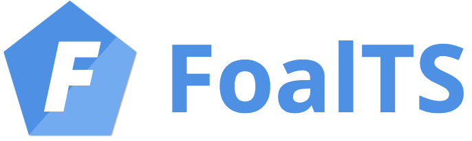
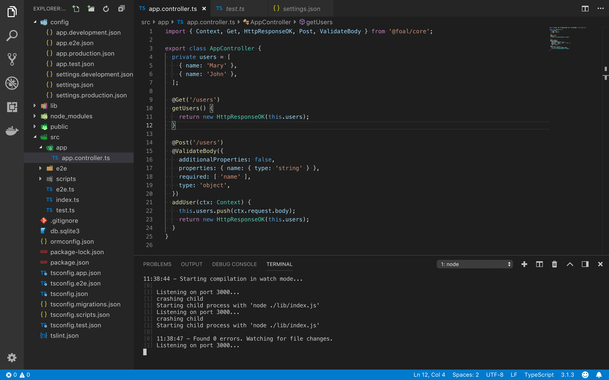

<p align="center">
  <a href="https://foalts.org" target="blank">
    
  </a>
  <br>
</p>

<p align="center">
  <i>:fire: A Node.js and TypeScript framework, all-inclusive. :boom: :rocket:</i>
  <br>
  <br>
  <a href="https://github.com/FoalTS/foal/blob/master/LICENSE">
    
  </a>
  
  <a href="https://badge.fury.io/js/%40foal%2Fcore">
    
  </a>
  <a href="https://github.com/FoalTS/foal/actions">
    
  </a>
  <a href="https://codecov.io/github/FoalTS/foal">
    
  </a>
  <a href="https://snyk.io/test/npm/@foal/core">
    
  </a>
  <a href="https://github.com/FoalTS/foal/commits/master">
    
  </a>
  <a href="https://github.com/FoalTS/foal/commits/master">
    
  </a>
  <a href="https://img.shields.io/badge/2FA-npm,%20GitHub-green.svg">
    
  </a>
  <a href="https://discord.gg/QUrJv98">
    
  </a>
</p>

<p align="center">
  <a href="https://foalts.org/">Website</a>
  -
  <a href="https://foalts.gitbook.io/docs/">Documentation</a>
  -
  <a href="https://twitter.com/foalts">Twitter</a>
  -
  <a href="https://www.youtube.com/channel/UCQFojM334E0YdoDq56MjfOQ">YouTube</a>
</p>

FoalTS is a Node.js framework for building HTTP APIs and Web applications with a rich interface (Angular / React / Vue). It is written in TypeScript and offers many built-in dev tools and components to handle extremely common scenarios. Simple, testable and progressive, Foal accelerates development while leaving you in control of your code.

## :city_sunrise: Get started

First install [Node.Js and npm](https://nodejs.org/en/download/).

### Create a new app

```
$ npm install -g @foal/cli
$ foal createapp my-app
$ cd my-app
$ npm run develop
```

The development server is started! Go to `http://localhost:3001` and find our welcoming page!

:point_right: [Continue with the tutorial](https://foalts.gitbook.io/docs/content/) :seedling:



## :dart: Motivation

In recent years Node.js has become one of the most popular servers on the web. And for good reason, it is fast, simple while being powerful and flexible. Creating a server with only a few lines of code has never been easier. 

But when it comes to setting up a complete and scalable project, things get harder. You have to put everything in place. The authorization system, database migrations, development tools or even hashing of passwords are just the tip of the iceberg. Working on this is time consuming and may slow down the release frequency or even lead to undesired bugs. As the codebase grows up and the complexity increases, it becomes harder and harder to develop new features and maintain the app.

This is where FoalTS comes in. Based on express, this lightweight framework provides everything needed to create enterprise-grade applications. From the support of TypeScript to the integration of security tools, it offers the basic bricks to build robust webapps. But FoalTS does not pretend to be a closed framework. You can still import and use your favorite librairies from the rich ecosystem of Node.js.

## :black_nib: Philosophy

### Simple

Keeping things simple is a challenge when creating an application. Simple code is easier to handle and understand, and therefore easier to maintain, debug and extend. Many frameworks, in trying to provide a large number of features and tools, tend to become complex, cumbersome and sometimes incomprehensible. In Foal, the architecture and components are designed to keep the code as simple as possible. Complexity is only used when there is no other option. 

### Testable

Too often, tests are set aside in web projects. Considered secondary, many frameworks do not encourage developers to write them and often make this task difficult. This is a pity, because writing tests really improves the long-term reliability of the product. They help to detect bugs in advance, prevent regressions and even improve application design as they are developed. FoalTS is different and aims to help developers write unit and acceptance tests. The entire framework provides both the architecture and the tools necessary for this purpose.

### Progressive

Building a proof of concept or a global application is not the same thing. The first one tests an idea and must be built quickly. The other is a large production system that must be reliable and serve thousands of customers. They both have different objectives and technical concerns. However, it is highly likely that the PoC built today will one day become the global application of tomorrow, with evolving technical goals and needs. FoalTS is designed to support you along the way. At first, the framework provides a default configuration, lightweight components and practical templates to quickly start a new project. Then, as the application evolves, Foal's components, tools and architecture adapt to allow you to customize and scale your product.

## Community Chat

You can join the community chat [here](https://discord.gg/QUrJv98).

## Contributing

See the [contribution guidelines](https://github.com/FoalTS/foal/blob/master/.github/CONTRIBUTING.MD).

## License

MIT 
