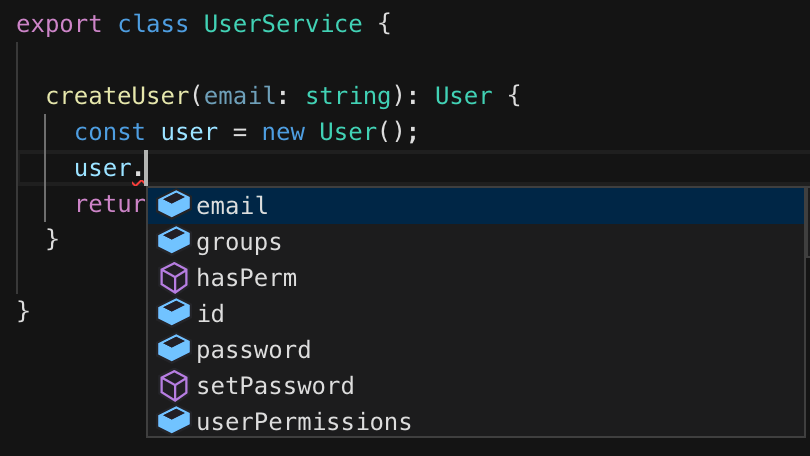
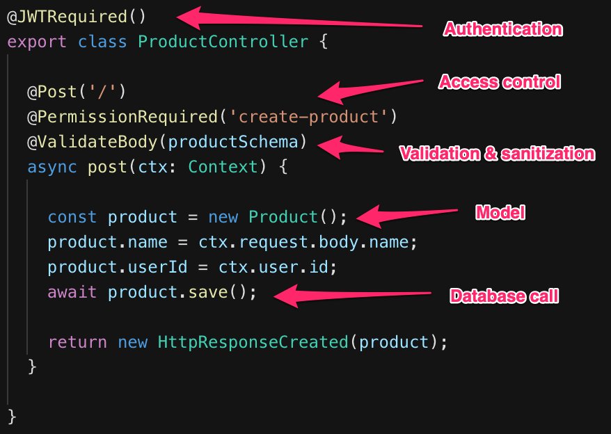
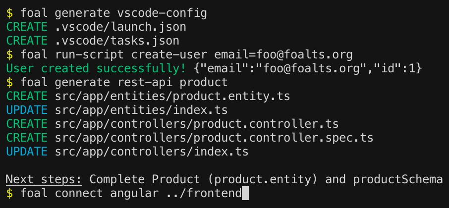

<p align="center">
  <a href="https://foalts.org" target="blank">
    
  </a>
  <br>
</p>

<p align="center">
  <i>:fire: A Web framework to create enterprise-grade Node.JS applications :boom: :rocket:</i>
  <br>
  <br>
  <a href="https://github.com/FoalTS/foal/blob/master/LICENSE">
    
  </a>
  
  <a href="https://badge.fury.io/js/%40foal%2Fcore">
    
  </a>
  <a href="https://travis-ci.org/FoalTS/foal">
    
  </a>
  <a href="https://codecov.io/github/FoalTS/foal">
    
  </a>
  <a href="https://snyk.io/test/npm/@foal/core">
    
  </a>
  <a href="https://github.com/FoalTS/foal/commits/master">
    
  </a>
  <a href="https://github.com/FoalTS/foal/commits/master">
    
  </a>
</p>

<p align="center">
  <a href="https://foalts.org/">Website</a>
  -
  <a href="https://foalts.gitbook.io/docs/content/">Documentation</a>
  -
  <a href="https://twitter.com/foalts">Twitter</a>
</p>

## :city_sunrise: Get started

First install [Node.Js and npm](https://nodejs.org/en/download/).

### Create a new app

```
$ npm install -g @foal/cli
$ foal createapp my-app
$ cd my-app
$ npm run develop
```

The development server is started! Go to `http://localhost:3000` and find our welcoming page!

:point_right: [Continue with the tutorial](https://foalts.gitbook.io/docs/content/) :seedling:

## :dart: Why?

In recent years Node.js has become one of the most popular servers on the web. And for good reason, it is fast, simple while being powerful and flexible. Creating a server with only a few lines of code has never been easier. 

But when it comes to setting up a complete and scalable project, things get harder. You have to put everything in place. The authorization system, database migrations, development tools or even encryption of passwords are just the tip of the iceberg. Working on this is time consuming and may slow down the release frequency or even lead to undesired bugs. As the codebase grows up and the complexity increases, it becomes harder and harder to develop new features and maintain the app.

This is where FoalTS comes in. Based on express, this lightweight framework provides everything needed to create enterprise-grade applications. From the support of TypeScript to the integration of security tools, it offers the basic bricks to build robust webapps. But FoalTS does not pretend to be a closed framework. You can still import and use your favorite librairies from the rich ecosystem of Node.js.

## :tulip: Features

### TypeScript

TypeScript brings you optional static type-checking along with the latest ECMAScript features. Writing FoalTS with TypeScript has been and will always be fundamental. Code is more elegant and concise. Most of the silly mistakes are caught at compilation. And autocompletion is well-handled and the API is better documented.

<p align="center">
  
</p>

### Essential components

Some patterns always come back while developing a web app. Set up a REST API, talk to the database or manage authentication shouldn't be a hard task. FoalTS lets you focus on the business logic, not on re-inventing the wheel.

<p align="center">
  
</p>

### Dev tools

Every project needs dev tools. But setting up and maintaining such an environment in Node.Js is often hard or time consuming. FoalTS focuses on helping the developer to code. Generators, watchers, the compiler, linter, bundler and test framework are all provided in FoalTS. No more set up, get started right away.

<p align="center">
  
</p>

## Ask a question

Feel free to ask a question by [submitting an issue](https://github.com/FoalTS/foal/issues/new/).

## Screenshot


## Contributing

See the [contribution guidelines](https://github.com/FoalTS/foal/blob/master/.github/CONTRIBUTING.MD)

## License

MIT
