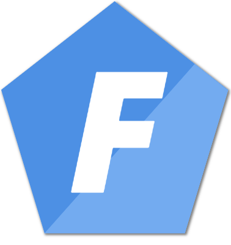
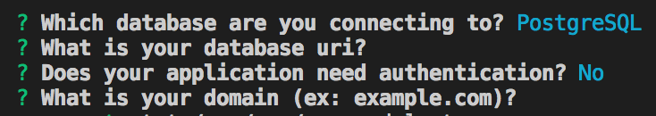

# Get started

<p align="center">
  <a href="https://foalts.org" target="blank">
    
  </a>
</p>

FoalTS is a high-level Node.JS to quickly buil web apps in TypeScript. Why should you use it?
- It is natively written in TypeScript and aims to be used with this language with all its features.
- It is designed to fastly bootstrap and develop an application. Authentication, REST API, developing tools, you don't need to re-invent the wheel anymore while programming with Node.JS.
- Its architecture can support growing app espacially when it deals with structuring the code. 

Let's get started!

## 1. Set up the Development Environment

Before starting anything, you need to set up your development environment.

First install [Node.Js and npm](https://nodejs.org/en/download/) if they are not already installed on your host.

Then install the FoalTS command line interface `@foal/cli`.

```sh
npm install -g @foal/cli
```

## 2. Create a new project

You are now ready to create your first foal project.

Open a terminal and then run the following command:

```sh
yo foal my-app
```

Some prompts should show up. Answer the questions as below.



A new folder `my-app` should now appear in your current directory with the dependencies installed. The foal generator automatically created the basic structure of your app with a set of developpment tools to easily get started.

## 3. Serve the application

Go the project directory and start the server.

```sh
cd my-app
npm run develop
```

Open you browser on `http://localhost:3000` and find our welcoming message!

> `npm run develop` starts the **development server**. It watches at your files and automatically compiles and reloads your code. You don’t need to restart the server each time you make code changes. Note that it is only intended to be used in development, do not use it on production. <!-- See the [8. Build and deploy](./guide/8-build-and-deploy.md) section for more details. -->

> **Port 3000 already in use?**
>
> You can modify in `config/base.js` which port the application is using.

## Next steps

What's the next move?

Read the [official guide](./guide/1-introduction.md) to learn more on `FoalTS`!

## Structure of the project

Let’s take a look at what `yo foal my-app` created:

### The `src` folder

The `src` contains all the code of your app.

### The parent folder

All files in the parent directory which don't belong to `src` are configuration files to build and lint your app.