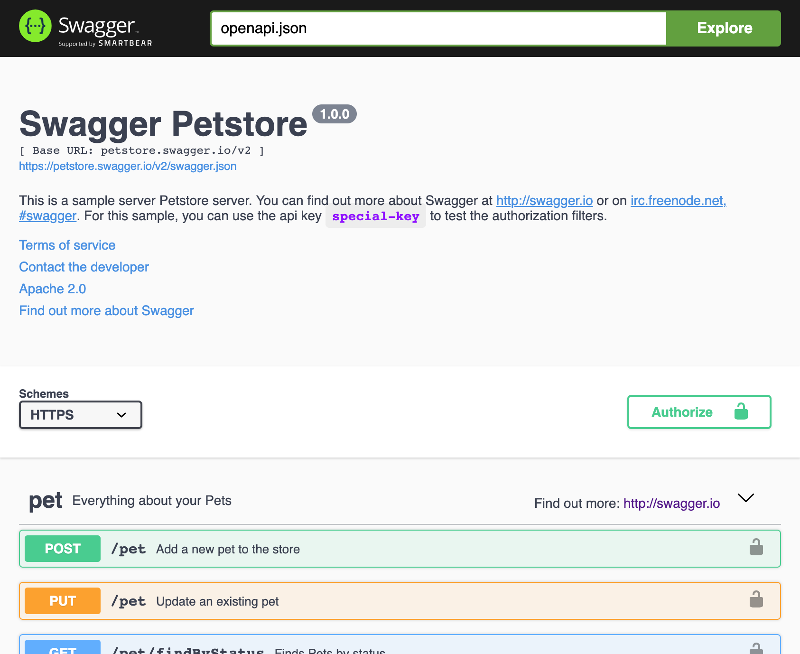
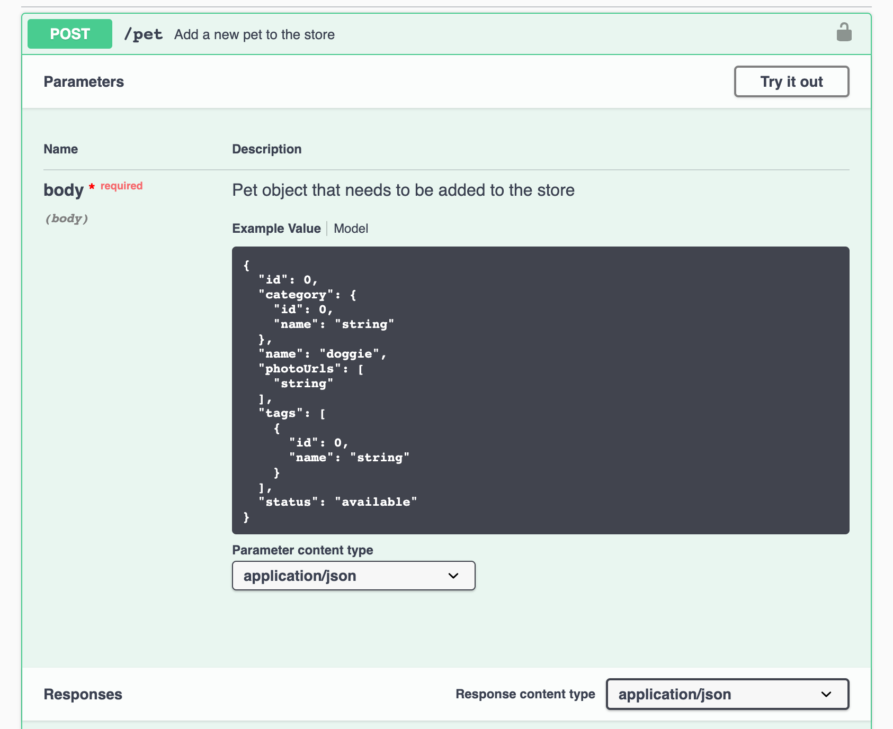

# OpenAPI & Swagger UI

## Swagger UI - A Graphical Interface to Visualize And interact with the API’s Resources




### Simple case

```typescript
import { SwaggerController } from '@foal/swagger';

import { ApiController } from './api.controller';

export class OpenApiController extends SwaggerController {
  options = { controllerClass: ApiController };
}

```

### Url

```typescript
import { SwaggerController } from '@foal/swagger';

export class OpenApiController extends SwaggerController {
  options = { url: 'https://petstore.swagger.io/v2/swagger.json' };
}

```

### Several APIs or versions


*app.controller.ts*
```typescript
import { controller } from '@foal/core';

import { ApiV1Controller, ApiV2ontroller, OpenApiController } from './controllers';

export class AppController {
  subControllers = [
    controller('/api', ApiV1Controller),
    controller('/api/v2', ApiV2Controller),
    controller('/swagger', OpenApiController),
  ]
}
```

*open-api.controller.ts*
```typescript
import { SwaggerController } from '@foal/swagger';

import { ApiV1Controller } from './api-v1.controller';
import { ApiV2Controller } from './api-v2.controller';

export class OpenApiController extends SwaggerController {
  options = [
    { name: 'v1', controllerClass: ApiV1Controller },
    { name: 'v2', controllerClass: ApiV2Controller, primary: true },
  ]
}
```

## Generate and Save a Specification File from the Command Line

```typescript
// std
import { writeFileSync } from 'fs';

// 3p
import { createOpenApiDocument } from '@foal/core';
import { stringify } from 'yamljs';

// App
import { ApiV1Controller } from '../app/controllers';

export async function main() {
  const document = createOpenApiDocument(ApiV1Controller);
  const yamlDocument = stringify(document);

  writeFileSync('openapi.yml', yamlDocument, 'utf8');
}

```

## Decorators

| Root Controller | Controllers / Methods | Methods |
| --- |  --- |  --- | 
| `@ApiInfo` | `@ApiServer` | `@ApiOperation` |
| | `@ApiSecurityRequirement` | `@ApiRequestBody` |
| | `@ApiDefineTag` | |
| | `@ApiExternalDoc` | |
| | `@ApiUseTag` | |
| | `@ApiParameter` | |
| | `@ApiResponse` | |
| | `@ApiCallback` | |
| | `@ApiDeprecated` | |
| | `@ApiDefineSchema` | |
| | `@ApiDefineResponse` | |
| | `@ApiDefineParameter` | |
| | `@ApiDefineExample` | |
| | `@ApiDefineRequestBody` | |
| | `@ApiDefineHeader` | |
| | `@ApiDefineSecurityScheme` | |
| | `@ApiDefineLink` | |
| | `@ApiDefineCallback` | |

## Examples