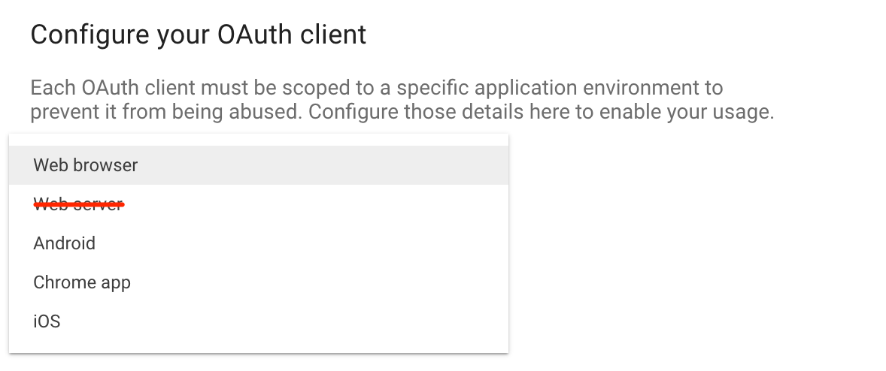
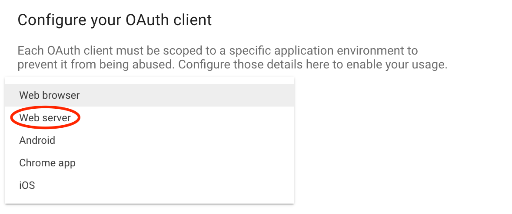

# Social Authentication

> FoalTS social authentication is based on OAuth2 protocol.

To set up social authentication with Foal, you first need to register your application to the social provider you chose (Google, Facebook, etc). This can be done through its website.

Usually your are required to provide:
- an *application name*,
- a *logo*,
- and *redirect URIs* where the social provider should redirect the users after successful authentication (ex: `http://localhost:3001`, `https://example.com`)

Once done, you should receive:
- a *client ID* that is public and identifies your application,
- and possibly a *client secret* that must not be revealed and can therefore only be used on the backend side.

## Google 1 (for SPA and Mobile)

> This section assumes that Google is the only authentication solution you use in your application. You do not use other social providers or passwords.

--

> A sample application can be found [here](https://github.com/FoalTS/foal/tree/master/samples/google-auth).

```
npm install @foal/jwt @foal/jwks-rsa
```

First, register your application to Google and add a "Sign-In" button to your frontend:
  - [Android](https://developers.google.com/identity/sign-in/android/start)
  - [iOS](https://developers.google.com/identity/sign-in/ios/start?ver=objc)
  - [Website](https://developers.google.com/identity/sign-in/web/sign-in)
  - [TVs and Devices](https://developers.google.com/identity/sign-in/devices)



Then, in the backend, add a configuration file that will contain the client ID. This can be an `.env`, YAML or JSON file:

*.env (option 1)*
```
SOCIAL_GOOGLE_CLIENT_ID=xxx.apps.googleusercontent.com
```

*config/default.yml (option 2)*
```yaml
social:
  google:
    clientId: xxx.apps.googleusercontent.com
```

*config/default.json (option 3)*
```json
{
  "social": {
    "google": {
      "clientId": "xxx.apps.googleusercontent.com"
    }
  }
}
```

Finally, add the `@JWTRequired` hook to your protected routes:

*api.controller.ts*
```typescript
import { Config, Context, Get, HttpResponseOK } from '@foal/core';
import { getRSAPublicKeyFromJWKS } from '@foal/jwks-rsa';
import { JWTRequired } from '@foal/jwt';

@JWTRequired({
  secretOrPublicKey: getRSAPublicKeyFromJWKS({
    jwksUri: 'https://www.googleapis.com/oauth2/v3/certs',
  })
}, {
  audience: Config.get('social.google.clientId'),
  issuer: [ 'accounts.google.com', 'https://accounts.google.com' ]
})
export class ApiController {

  @Get('/')
  index(ctx: Context) {
    return new HttpResponseOK(
      `Your email is ${ctx.user.email}!`
    );
  }

}
```

Now, when making a request to the backend, your frontend must include the Google **ID token** in the `Authorization` header using the `Bearer` scheme:

```
Authorization: Bearer xxx.yyy.zzz
```

For example, in a browser, you can retrieve this token with the following code:

```javascript
function onSignIn(googleUser) {
  var id_token = googleUser.getAuthResponse().id_token;
  // ...
}
```

## Google 2

> This method uses cookies.

```
npm install @foal/social
```

First, register your application to Google: go to [this page](https://developers.google.com/identity/sign-in/web/sign-in#before_you_begin) and click on `Configure a project`. Do not follow the other instructions given in this page.

When prompted, select the option `Web server`.



You should get in exchange a client ID and a client secret.

Then, in the backend, add a `.env` configuration file to store them.

```
SOCIAL_GOOGLE_CLIENT_ID=xxx.apps.googleusercontent.com
SOCIAL_GOOGLE_CLIENT_SECRET=yyy
```

*auth.controller.ts*
```typescript
// 3p
import {
  Context,
  dependency,
  Get,
  HttpResponseRedirect,
  setSessionCookie,
} from '@foal/core';
import { GoogleProvider } from '@foal/social';
import { TypeORMStore } from '@foal/typeorm';

export class AuthController {
  @dependency
  google: GoogleProvider;

  @dependency
  store: TypeORMStore;

  @Get('/signin/google')
  redirectToGoogle() {
    return this.google.redirect();
  }

  @Get('/signin/google/cb')
  async handleGoogleRedirection(ctx: Context) {
    const googleUser = await this.google.getUser(ctx);
    const session = await this.store.createAndSaveSession({
      profile: googleUser.profile
    });
    const response = new HttpResponseRedirect('/');
    setSessionCookie(response, session.getToken());
    return response;
  }

}
```

## Facebook

> This method uses cookies.

```
npm install @foal/social
```

Coming soon.
