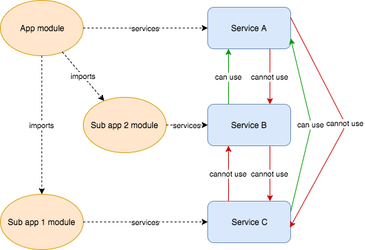

# Modules

Every app starts with a module. A module instantiates services and binds controllers to the request handler. It may import other ones. They're espacially interesting when a project grows up.

## Example

```typescript
import { rest } from '@foal/common';
import { FoalModule } from '@foal/core';
// module and service imports ...

const AppModule: FoaModule = {
  controllers: [
    rest.attachService('/my_resources', MyCRUDService)
  ],
  hooks: [
    myFirstPreHook(),
    mySecondPreHook(),
    myPostHook()
  ],
  modules: [
    { module: MyModule }
    { module: Team1Module, path: '/team1' },
    { module: Team2Module, path: '/team2' },
  ]
}
```

## Nested modules

TODO: explain how services are instantiated and how the services attribute can be used (prototype pattern).

