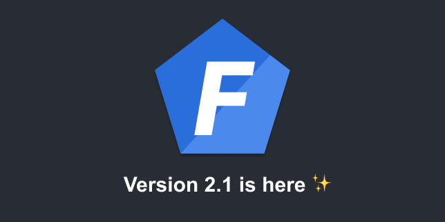

Version 2.1 has been released! Here are the improvements that it brings.

<!--truncate-->

## New Error Page Design

When an error is thrown or rejected in development, the server returns an error page with some debugging details. The UI of this page has been improved and it now provides more information.


## New Welcome Page

When creating a new project, the generated welcome page is also different.


## CLI exits with code 1 when a command fails

This small improvement is useful when we want to stop a CI pipeline when one of its commands fails.

## New `@All` decorator

This decorator handles all requests regardless of the HTTP verb (GET, POST, etc.).

It can be used for example to create a `not found` handler.

```typescript
import { All, HttpResponseNotFound } from '@foal/core';

class AppController {
  subControllers = [ ViewController ];

  @All('*')
  notFound() {
    return new HttpResponseNotFound('The route you are looking for does not exist.');
  }
}
```

## New CSRF option in `@UseSessions` and `@JWT`

This option allows you to override the behavior of the configuration specified globally with the key `settings.session.csrf.enabled` or the key `settings.jwt.csrf.enabled`.

It can be useful for example to disable the CSRF protection on a specific route.

```typescript
import { HttpResponseOK, Post, UseSessions } from '@foal/core';

export class ApiController {
  @Post('/foo')
  @UseSessions({ cookie: true })
  foo() {
    // This method has the CSRF protection enabled.
    return new HttpResponseOK();
  }

  @Post('/bar')
  @UseSessions({ cookie: true, csrf: false })
  bar() {
    // This method does not have the CSRF protection enabled.
    return new HttpResponseOK();
  }
}

```

## Support of `better-sqlite3`

When using Foal with SQLite, you now have the choice between two drivers: `sqlite3` and `better-sqlite3`. The package `better-sqlite3` is used by default in new projects starting from this version on.