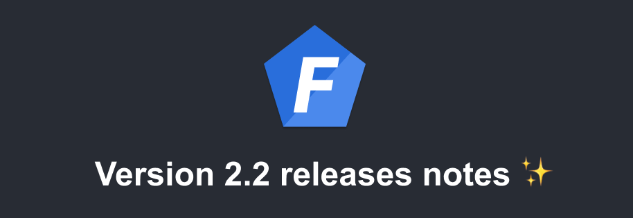
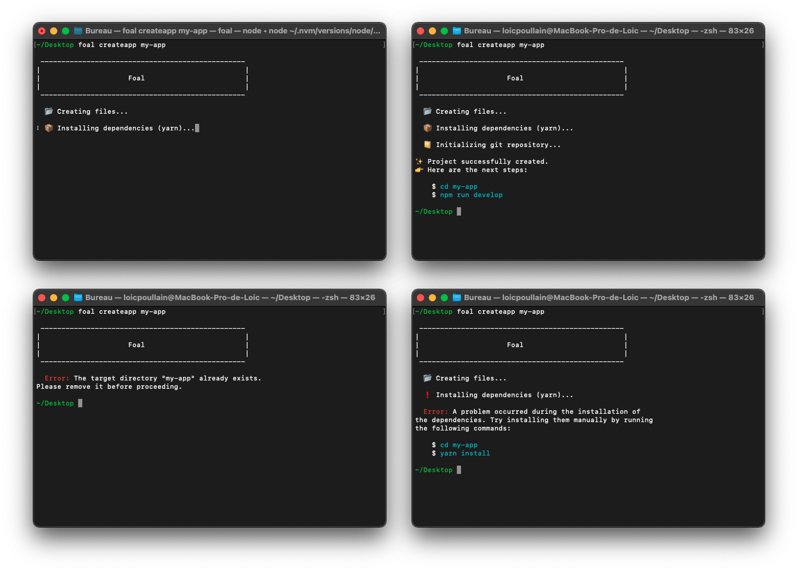

Version 2.2 of Foal has been released! Here are the improvements that it brings.

<!--truncate-->

## New Look of the `createapp` Command

The output of the `createapp` command has been prettified to be more "welcoming".



## Authentication Improvement for Single-Page Applications (SPA)

When building a SPA with cookie-based authentication, it can sometimes be difficult to know if the user is logged in or to obtain certain information about the user (`isAdmin`, etc).

Since the authentication token is stored in a cookie with the `httpOnly` directive set to `true` (to mitigate XSS attacks), the front-end application has no way of knowing if a user is logged in, except by making an additional request to the server.

To solve this problem, version 2.2 adds a new option called `userCookie` that allows you to set an additional cookie that the frontend can read with the content you choose. This cookie is synchronized with the session and is refreshed at each request and destroyed when the session expires or when the user logs out.

In the following example, the `user` cookie is empty if no user is logged in or contains certain information about him/her otherwise. This is particularly useful if you need to display UI elements based on user characteristics.

*Server-side code*

```typescript
function userToJSON(user: User|undefined) {
  if (!user) {
    return 'null';
  }

  return JSON.stringify({
    email: user.email,
    isAdmin: user.isAdmin
  });
}

@UseSessions({
  cookie: true,
  user: fetchUser(User),
  userCookie: (ctx, services) => userToJSON(ctx.user)
})
export class ApiController {

  @Get('/products')
  @UserRequired()
  async readProducts(ctx: Context) {
    const products = await Product.find({ owner: ctx.user });
    return new HttpResponseOK(products);
  }

}
```

*Cookies*


*Client-side code*

```javascript
const user = JSON.parse(decodeURIComponent(/* cookie value */));
```

## Support of Nested Routes in `foal generate|g rest-api <name>`

Like the command `g controller`, `g rest-api` now supports nested routes.

Let's say we have the following file structure:

```
src/
 '- app/
  |- controllers/
  | |- api.controller.ts
  | '- index.ts
  '- entities/
    |- user.entity.ts
    '- index.ts
```

Running these commands will add and register the following files:

```
foal generate rest-api api/product --auth --register
foal generate rest-api api/order --auth --register
```

```
src/
 '- app/
  |- controllers/
  | |- api/
  | | |- product.controller.ts
  | | |- order.controller.ts
  | | '- index.ts
  | |- api.controller.ts
  | '- index.ts
  '- entities/
    |- product.entity.ts
    |- order.entity.ts
    |- user.entity.ts
    '- index.ts
```