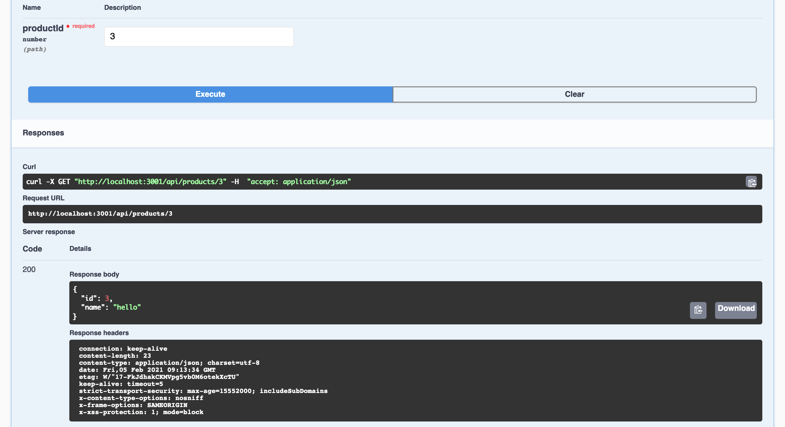

import Tabs from '@theme/Tabs';
import TabItem from '@theme/TabItem';


This article presents some improvements introduced in version 2 of FoalTS:
- Configuration and type safety
- Configuration and `.env` files (`.env`, `.env.test`, etc)
- Available configuration file formats (JSON, YAML and JS)
- OpenAPI schemas and validation

<!--truncate-->

> This article is the part 2 of the series of articles *What's new in version 2.0*. Part 1 can be found [here](./2021-02-17-whats-new-in-version-2-part-1.md).

## New Config System

### Type safety

Starting from version 2, a great attention is paid to type safety in the configuration. The `Config.get` method allows you specify which type you expect.

```typescript
const timeout = Config.get('custom.timeout', 'number');
// The TypeScript type returned by `get` is number|undefined.
```

In this example, when calling the `get` method, the framework will look at the configuration files to retrieve the desired value.
- If the value is not defined, the function returns `undefined`.
- If the value is a number, the function returns it.
- If the value is a string that can be converted to a number (ex: `"1"`), the function converts and returns it.
- If the value is not a number and cannot be converted, then the function throws a `ConfigTypeError` with the details. Note that the config value is not logged to avoid leaking sensitive information.

If you wish to make the config parameter mandatory, you can do it by using the `getOrThrow` method. If no value is found, then a `ConfigNotFound` error is thrown.

```typescript
const timeout = Config.getOrThrow('custom.timeout', 'number');
// The TypeScript type returned by `get` is number.
```

Supported types are `string`, `number`, `boolean`, `boolean|string`, `number|string` and `any`.

### Multiple `.env` files support

Version 2 allows you to use different `.env` files depending on your environment.

If you configuration is as follows and `NODE_ENV` equals `production`, then the framework will look at `.env.production` to retrieve the value and if it does not exist (the file or the value), Foal will look at `.env`.

<Tabs
  defaultValue="yaml"
  values={[
    {label: 'YAML', value: 'yaml'},
    {label: 'JSON', value: 'json'},
    {label: 'JS', value: 'js'},
  ]}
>
<TabItem value="yaml">

```yaml
settings:
  jwt:
    secret: env(SETTINGS_JWT_SECRET)
```

</TabItem>
<TabItem value="json">

```json
{
  "settings": {
    "jwt": {
      "secret": "env(SETTINGS_JWT_SECRET)",
    }
  }
}
```

</TabItem>
<TabItem value="js">

```javascript
const { Env } = require('@foal/core');

module.exports = {
  settings: {
    jwt: {
      secret: Env.get('SETTINGS_JWT_SECRET')
    }
  }
}
```

</TabItem>
</Tabs>


### Three config formats (JS, JSON, YAML)

JSON and YAML were already supported in version 1. Starting from version 2, JS is also allowed.

<Tabs
  defaultValue="yaml"
  values={[
    {label: 'YAML', value: 'yaml'},
    {label: 'JSON', value: 'json'},
    {label: 'JS', value: 'js'},
  ]}
>
<TabItem value="yaml">

```yaml
settings:
  session:
    store: "@foal/typeorm"
```

</TabItem>
<TabItem value="json">

```json
{
  "settings": {
    "session": {
      "store": "@foal/typeorm"
    }
  }
}
```

</TabItem>
<TabItem value="js">

```javascript
module.exports = {
  settings: {
    session: {
      store: "@foal/typeorm"
    }
  }
}
```

</TabItem>
</Tabs>

### More Liberty in Naming Environment Variables

In version 1, the names of the environment variables were depending on the names of the configuration keys. For example, when using `Config.get('settings.mongodbUri')`, Foal was looking at `SETTINGS_MONGODB_URI`.

Starting from version 2, it is your responsability to choose the environement variable that you want to use (if you use one). This gives more flexibility especially when a Cloud provider defines its own variable names.

<Tabs
  defaultValue="yaml"
  values={[
    {label: 'YAML', value: 'yaml'},
    {label: 'JSON', value: 'json'},
    {label: 'JS', value: 'js'},
  ]}
>
<TabItem value="yaml">

```yaml
settings:
  mongodbUri: env(MONGODB_URI)
```

</TabItem>
<TabItem value="json">

```json
{
  "settings": {
    "mongodbUri": "env(MONGODB_URI)"
  }
}
```

</TabItem>
<TabItem value="js">

```javascript
const { Env } = require('@foal/core');

module.exports = {
  settings: {
    mongodbUri: Env.get('MONGODB_URI')
  }
}
```

</TabItem>
</Tabs>

## OpenAPI Schemas & Validation

Starting from version 1, Foal has allowed you to generate a complete [Swagger](https://swagger.io/tools/swagger-ui/) interface by reading your code. If your application has validation and auth hooks for example, Foal will use them to generate the proper interface.

This is a handy if you want to quickly test and document your API. Then you can customize it in your own way if you wish and complete and override the OpenAPI spec generated by the framework.

In version 2, support of Swagger has been increased to allow you to define OpenAPI schemas and re-use them for validation.

Here is an example.

*product.controller.ts*
```typescript
import { ApiDefineSchema, ApiResponse, Context, Get, HttpResponseNotFound, HttpResponseOK, Post, ValidateBody, ValidatePathParam } from '@foal/core';
import { Product } from '../../entities';

// First we define the OpenAPI schema "Product".
@ApiDefineSchema('Product', {
  type: 'object',
  properties: {
    id: { type: 'number' },
    name: { type: 'string' }
  },
  additionalProperties: false,
  required: ['id', 'name'],
})
export class ProductController {

  @Post('/')
  // We use the schema "Product" here to validate the request body.
  @ValidateBody({ $ref: '#/components/schemas/Product' })
  async createProduct(ctx: Context) {
    const result = await Product.insert(ctx.request.body);
    return new HttpResponseOK(result.identifiers[0]);
  }

  @Get('/:productId')
  // We use the schema "Product" here to validate the URL parameter.
  @ValidatePathParam('productId', { $ref: '#/components/schemas/Product/properties/id' })
  // We give some extra information on the format of the response.
  @ApiResponse(200, {
    description: 'Product found in the database',
    content: {
      'application/json': { schema: { $ref: '#/components/schemas/Product' } }
    }
  })
  async readProduct(ctx: Context, { productId }) {
    const product = await Product.findOne({ id: productId });

    if (!product) {
      return new HttpResponseNotFound();
    }

    return new HttpResponseOK(product);
  }

}

```

*api.controller.ts*
```typescript
import { ApiInfo, ApiServer, Context, controller, Get, HttpResponseOK } from '@foal/core';
import { ProductController } from './api';

// We provide the "info" metadata to describe the API.
@ApiInfo({
  title: 'My API',
  version: '0.1.0'
})
@ApiServer({
  url: '/api'
})
export class ApiController {
  subControllers = [
    controller('/products', ProductController)
  ];
  
}
```

*openapi.controller.ts*
```typescript
import { SwaggerController } from '@foal/swagger';
import { ApiController } from './api.controller';

// This controller generates the Swagger interface.
export class OpenapiController extends SwaggerController {

  options = {
    controllerClass: ApiController,
  }

}

```

*app.controller.ts*
```typescript
import { controller, IAppController } from '@foal/core';
import { createConnection } from 'typeorm';

import { ApiController, OpenapiController } from './controllers';

export class AppController implements IAppController {
  subControllers = [
    controller('/api', ApiController),
    controller('/swagger', OpenapiController),
  ];

  async init() {
    await createConnection();
  }
}

```


