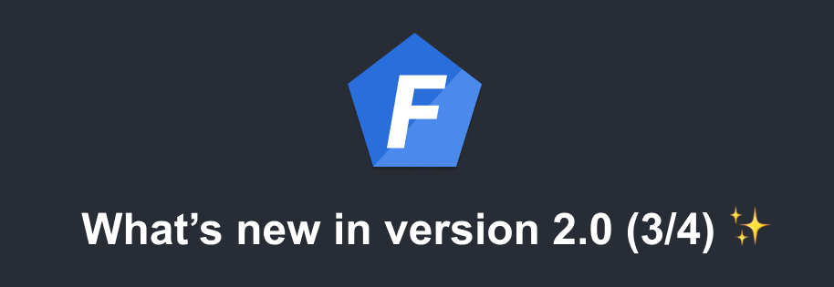

import Tabs from '@theme/Tabs';
import TabItem from '@theme/TabItem';



This article presents some improvements introduced in version 2 of FoalTS:
- the JWT utilities to manage secrets and RSA keys,
- the JWT utilities to manage cookies,
- and the new stateless CSRF protection.

<!--truncate-->

> This article is the part 3 of the series of articles *What's new in version 2.0*. Part 2 can be found [here](./2021-03-02-whats-new-in-version-2-part-2.md).

## New JWT utilities

### Accessing config secrets and public/private keys

Starting from version 2, there is a standardized way to provide and retrieve JWT secrets and RSA public/private keys: the functions `getSecretOrPublicKey` and `getSecretOrPrivateKey`.

#### Using secrets

In this example, a base64-encoded secret is provided in the configuration.

*.env*
```
JWT_SECRET="Ak0WcVcGuOoFuZ4oqF1tgqbW6dIAeSacIN6h7qEyJM8="
```


<Tabs
  defaultValue="yaml"
  values={[
    {label: 'YAML', value: 'yaml'},
    {label: 'JSON', value: 'json'},
    {label: 'JS', value: 'js'},
  ]}
>
<TabItem value="yaml">

```yaml
settings:
  jwt:
    secret: "env(JWT_SECRET)"
    secretEncoding: base64
```

</TabItem>
<TabItem value="json">

```json
{
  "settings": {
    "jwt": {
      "secret": "env(JWT_SECRET)",
      "secretEncoding": "base64"
    }
  }
}
```

</TabItem>
<TabItem value="js">

```javascript
module.exports = {
  settings: {
    jwt: {
      secret: "env(JWT_SECRET)",
      secretEncoding: "base64"
    }
  }
}
```

</TabItem>
</Tabs>

Both `getSecretOrPublicKey` and `getSecretOrPrivateKey` functions will return the secret.

In the case a `secretEncoding` value is provided, the functions return a buffer which is the secret decoded with the provided encoding.

#### Using public and private keys

```javascript
const { Env } = require('@foal/core');
const { readFileSync } = require('fs');

module.exports = {
  settings: {
    jwt: {
      privateKey: Env.get('RSA_PRIVATE_KEY') || readFileSync('./id_rsa', 'utf8'),
      publicKey: Env.get('RSA_PUBLIC_KEY') || readFileSync('./id_rsa.pub', 'utf8'),
    }
  }
}
```

In this case, `getSecretOrPublicKey` and `getSecretOrPrivateKey` return the keys from the environment variables `RSA_PUBLIC_KEY` and `RSA_PRIVATE_KEY` if they are defined or from the files `id_rsa` and `id_rsa.pub` otherwise.

### Managing cookies

In version 2, Foal provides two dedicated functions to manage JWT with cookies. Using these functions instead of manually setting the cookie has three benefits:
- they include a CSRF protection (see section below),
- the function `setAuthCookie` automatically sets the cookie expiration based on the token expiration,
- and cookie options can be provided through the configuration.

**Example**

*api.controller.ts*
```typescript
import { JWTRequired } from '@foal/jwt';

@JWTRequired({ cookie: true })
export class ApiController {
  // ...
}
```

*auth.controller.ts*
```typescript
export class AuthController {

  @Post('/login')
  async login(ctx: Context) {
    // ...

    const response = new HttpResponseNoContent();
    // Do not forget the "await" keyword.
    await setAuthCookie(response, token);
    return response;
  }

  @Post('/logout')
  logout(ctx: Context) {
    // ...

    const response = new HttpResponseNoContent();
    removeAuthCookie(response);
    return response;
  }

}
```

**Cookie options**

<Tabs
  defaultValue="yaml"
  values={[
    {label: 'YAML', value: 'yaml'},
    {label: 'JSON', value: 'json'},
    {label: 'JS', value: 'js'},
  ]}
>
<TabItem value="yaml">

```yaml
settings:
  jwt:
    cookie:
      name: mycookiename # Default: auth
      domain: example.com
      httpOnly: true # Warning: unlike session tokens, the httpOnly directive has no default value.
      path: /foo # Default: /
      sameSite: strict # Default: lax if settings.jwt.csrf.enabled is true.
      secure: true
```

</TabItem>
<TabItem value="json">

```json
{
  "settings": {
    "jwt": {
      "cookie": {
        "name": "mycookiename",
        "domain": "example.com",
        "httpOnly": true,
        "path": "/foo",
        "sameSite": "strict",
        "secure": true
      }
    }
  }
}
```

</TabItem>
<TabItem value="js">

```javascript
module.exports = {
  settings: {
    jwt: {
      cookie: {
        name: "mycookiename",
        domain: "example.com",
        httpOnly: true,
        path: "/foo",
        sameSite: "strict",
        secure: true
      }
    }
  }
}
```

</TabItem>
</Tabs>

## Stateless CSRF protection simplified

In version 1, providing a CSRF protection was quite complex. We needed to provide another secret, generate a stateless token, manage the CSRF cookie (expiration, etc), use an additional hook, etc.

Starting from version 2, the CSRF protection is all managed by `@JWTRequired`, `setAuthCookie` and `removeAuthCookie`.

The only thing that you have to do it to enable it through the configuration:

<Tabs
  defaultValue="yaml"
  values={[
    {label: 'YAML', value: 'yaml'},
    {label: 'JSON', value: 'json'},
    {label: 'JS', value: 'js'},
  ]}
>
<TabItem value="yaml">

```yaml
settings:
  jwt:
    csrf:
      enabled: true
```

</TabItem>
<TabItem value="json">

```json
{
  "settings": {
    "jwt": {
      "csrf": {
        "enabled": true
      }
    }
  }
}
```

</TabItem>
<TabItem value="js">

```javascript
module.exports = {
  settings: {
    jwt: {
      csrf: {
        enabled: true
      }
    }
  }
}
```

</TabItem>
</Tabs>

When it is enabled, an additional `XSRF-TOKEN` cookie is sent to the client at the same time as the auth cookie (containing your JWT). It contains a stateless CSRF token which is signed and has the same expiration date as your JWT.

When a request is made to the server, the `@JWTRequired` hooks expects you to include its value in the `XSRF-TOKEN` header.
