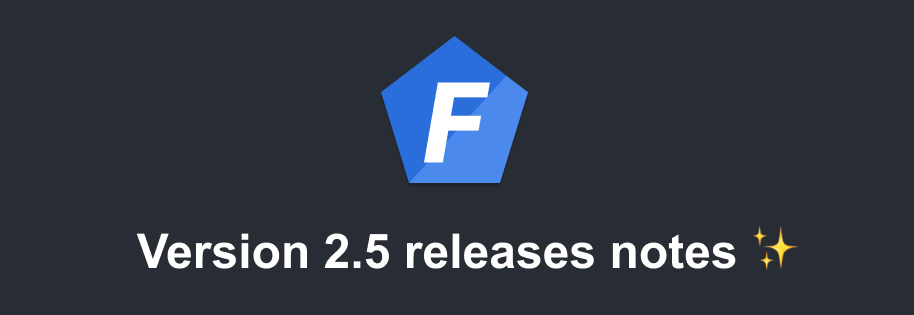

Version 2.5 of Foal has been released! Here are the improvements that it brings.

<!--truncate-->

## `npm run develop` watches config files

In previous versions of Foal, the `develop` command did not restart the server when a configuration file was changed. This was annoying and is the reason why, starting with v2.5, new projects generated by the CLI will watch configuration files.

## `createOpenApiDocument` accepts an optional serviceManager

If you use `createOpenApiDocument`, in a shell script for example, the function accepts an optional `serviceManager` parameter from this version.

This can be useful if your OpenAPI decorators access controller properties whose values are manually injected.
