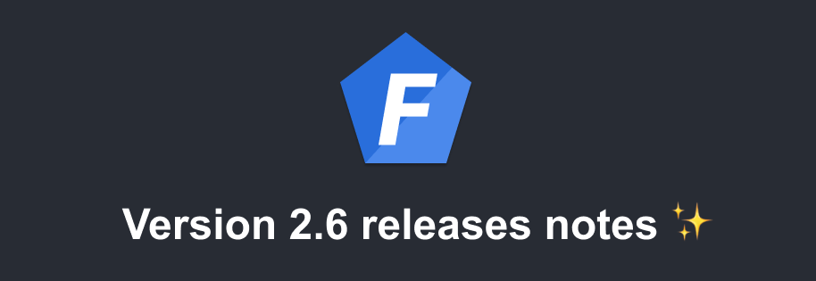

Version 2.6 of Foal has been released! Here are the improvements that it brings.

<!--truncate-->

## Support of the `array` value for AJV `coerceTypes` option

```json
{
  "settings": {
    "ajv": {
      "coerceTypes": "array"
    }
  }
}
```

Option documentation: [https://ajv.js.org/coercion.html#coercion-to-and-from-array](https://ajv.js.org/coercion.html#coercion-to-and-from-array).

## Swagger page supports strict CSP

Inline scripts in the Swagger page have been removed to support more strict *Content Security Policy* directive.

## Bug fixes

The `foal connect angular` command now supports empty `angular.json` files.