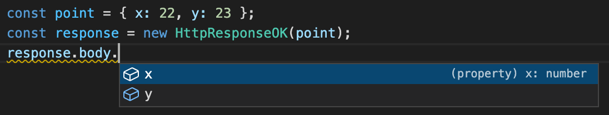

Version 2.7 of Foal has been released! Here are the improvements that it brings.

<!--truncate-->

## The body of `HttpResponse` can be typed

The `HttpResponse` class becomes generic so as to enforce the type of its `body` property if needed.

```typescript
import { Get, HttpResponse } from '@foal/core';

import { Product } from '../entities';

export class AppController {
  @Get('/products')
  async products(): HttpResponse<Product[]> {
    const products = await Product.find({});
    return new HttpResponse(products);
  }
}
```

It also allows you to infer the type of the body in your tests:



## Support for signed cookies

Starting from this version, you can sign cookies and read them through the `signedCookies` attribute.

```typescript
import { Context, HttpResponseOK, Get, Post } from '@foal/core';

class AppController {
  @Get('/')
  index(ctx: Context) {
    const cookie1: string|undefined = ctx.request.signedCookies.cookie1;
    // Do something.
    return new HttpResponseOK();
  }

  @Post('/sign-cookie')
  index() {
    return new HttpResponseOK()
      .setCookie('cookie1', 'value1', {
        signed: true
      });
  }
}
```

> In order to use signed cookies, you must provide a secret with the configuration key `settings.cookieParser.secret`.

## Environment name can be provided via `NODE_ENV` or `FOAL_ENV`

Version 2.7 allows to you to specify the environment name (production, development, etc) with the `FOAL_ENV` environment variable.

This can be useful if you have third party libraries whose behavior also depends on the value of `NODE_ENV` (see [Github issue here](https://github.com/FoalTS/foal/issues/1004)).

## `foal generate entity` and `foal generate hook` support sub-directories

### Example with entities (models)

```shell
foal g entity user
foal g entity business/product
```

*Output*
```
src/
 '- app/
  '- entities/
   |- business/
   | |- product.entity.ts
   | '- index.ts
   |- user.entity.ts
   '- index.ts
```

### Example with hooks

```shell
foal g hook log
foal g hook auth/admin-required
```

*Output*
```
src/
 '- app/
  '- hooks/
   |- auth/
   | |- admin-required.hook.ts
   | '- index.ts
   |- log.hook.ts
   '- index.ts
```

## New `afterPreMiddlewares` option in `createApp`

It is now possible to run a custom middleware after all internal Express middlewares of the framework.

This can be useful in rare situations, for example when using the [RequestContext helper](https://mikro-orm.io/docs/identity-map/#-requestcontext-helper-for-di-containers) in Mikro-ORM.

```typescript
const app = await createApp({
   afterPreMiddlewares: [
      (req, res, next) => {
         RequestContext.create(orm.em, next);
      }
   ]
})
```


## Contributors

- [@MCluck90](https://github.com/MCluck90)
- [@kingdun3284](https://github.com/kingdun3284)