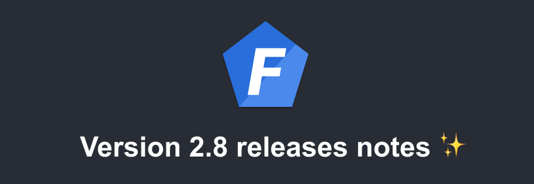

import Tabs from '@theme/Tabs';
import TabItem from '@theme/TabItem';



Version 2.8 of Foal has been released! Here are the improvements that it brings.

<!--truncate-->

## WebSocket support and `socket.io` integration

As of version 2.8, Foal officially supports WebSockets, allowing you to establish two-way interactive communication between your server(s) and your clients.

The architecture includes: controllers and sub-controllers, hooks, success and error responses, message broadcasting, rooms, use from HTTP controllers, DI, error-handling, validation, unit testing, horizontal scalability, auto-reconnection, etc

### Get Started

#### Server

```bash
npm install @foal/socket.io
```

*services/websocket.service.ts*
```typescript
import { EventName, ValidatePayload, SocketIOController, WebsocketContext, WebsocketResponse } from '@foal/socket.io';

export class WebsocketController extends SocketIOController {

  @EventName('create product')
  @ValidatePayload({
    additionalProperties: false,
    properties: { name: { type: 'string' }},
    required: [ 'name' ],
    type: 'object'
  })
  async createProduct(ctx: WebsocketContext, payload: { name: string }) {
    const product = new Product();
    product.name = payload.name;
    await product.save();

    // Send a message to all clients.
    ctx.socket.broadcast.emit('refresh products');
    return new WebsocketResponse();
  }

}
```

*src/index.ts*

```typescript
// ...

async function main() {
  const serviceManager = new ServiceManager();

  const app = await createApp(AppController, { serviceManager });
  const httpServer = http.createServer(app);

  // Instanciate, init and connect websocket controllers.
  await serviceManager.get(WebsocketController).attachHttpServer(httpServer);

  // ...
}

```

#### Client

> This example uses JavaScript code as client, but socket.io supports also [many other languages](https://socket.io/docs/v4) (python, java, etc).

```bash
npm install socket.io-client@4
```

```typescript
import { io } from 'socket.io-client';

const socket = io('ws://localhost:3001');

socket.on('connect', () => {

  socket.emit('create product', { name: 'product 1' }, response => {
    if (response.status === 'error') {
      console.log(response.error);
    }
  });

});

socket.on('connect_error', () => {
  console.log('Impossible to establish the socket.io connection');
});

socket.on('refresh products', () => {
  console.log('refresh products!');
});
```

> When using socket.io with FoalTS, the client function `emit` can only take one, two or three arguments.
> ```typescript
> socket.emit('event name');
> socket.emit('event name', { /* payload */ });
> // The acknowledgement callback must always be passed in third position.
> socket.emit('event name', { /* payload */ }, response => { /* do something */ });
> ```

### Architecture

#### Controllers and hooks

The WebSocket architecture is very similar to the HTTP architecture. They both have controllers and hooks. While HTTP controllers use paths to handle the various application endpoints, websocket controllers use event names. As with HTTP, event names can be extended with subcontrollers.

*user.controller.ts*
```typescript
import { EventName, WebsocketContext } from '@foal/socket.io';

export class UserController {

  @EventName('create')
  createUser(ctx: WebsocketContext) {
    // ...
  }

  @EventName('delete')
  deleteUser(ctx: WebsocketContext) {
    // ...
  }

}
```

*websocket.controller.ts*
```typescript
import { SocketIOController, wsController } from '@foal/socket.io';

import { UserController } from './user.controller.ts';

export class WebsocketController extends SocketIOController {
  subControllers = [
    wsController('users ', UserController)
  ];
}
```

> Note that the event names are simply concatenated. So you have to manage the spaces between the words yourself if there are any.

##### Contexts

The `Context` and `WebsocketContext` classes share common properties such as the `state`, the `user` and the `session`.


However, unlike their HTTP version, instances of `WebsocketContext` do not have a `request` property but a `socket` property which is the object provided by socket.io. They also have two other attributes: the `eventName` and the `payload` of the request.

##### Responses

A controller method returns a response which is either a `WebsocketResponse` or a `WebsocketErrorResponse`.

If a `WebsocketResponse(data)` is returned, the server will return to the client an object of this form:
```typescript
{
  status: 'ok',
  data: data
}
```


If it is a `WebsocketErrorResponse(error)`, the returned object will look like this:
```typescript
{
  status: 'error',
  error: error
}
```

> Note that the `data` and `error` parameters are both optional.

##### Hooks

In the same way, Foal provides hooks for websockets. They work the same as their HTTP version except that some types are different (`WebsocketContext`, `WebsocketResponse|WebsocketErrorResponse`).

```typescript
import { EventName, WebsocketContext, WebsocketErrorResponse, WebsocketHook } from '@foal/socket.io';

export class UserController {

  @EventName('create')
  @WebsocketHook((ctx, services) => {
    if (typeof ctx.payload.name !== 'string') {
      return new WebsocketErrorResponse('Invalid name type');
    }
  })
  createUser(ctx: WebsocketContext) {
    // ...
  }
}
```

##### Summary table

| HTTP | Websocket |
| --- | --- |
| `@Get`, `@Post`, etc | `@EventName` |
| `controller` | `wsController` |
| `Context` | `WebsocketContext` |
| `HttpResponse`(s) | `WebsocketResponse`, `WebsocketErrorResponse` |
| `Hook` | `WebsocketHook` |
| `MergeHooks` | `MergeWebsocketHooks` |
| `getHookFunction`, `getHookFunctions` | `getWebsocketHookFunction`, `getWebsocketHookFunctions` |

#### Send a message

At any time, the server can send one or more messages to the client using its `socket` object.

*Server code*
```typescript
import { EventName, WebsocketContext, WebsocketResponse } from '@foal/socket.io';

export class UserController {

  @EventName('create')
  createUser(ctx: WebsocketContext) {
    ctx.socket.emit('event 1', 'first message');
    ctx.socket.emit('event 1', 'second message');
    return new WebsocketResponse();
  }
}
```

*Client code*
```typescript
socket.on('event 1', payload => {
  console.log('Message: ', payload);
});
```

#### Broadcast a message

If a message is to be broadcast to all clients, you can use the `broadcast` property for this.

*Server code*
```typescript
import { EventName, WebsocketContext, WebsocketResponse } from '@foal/socket.io';

export class UserController {

  @EventName('create')
  createUser(ctx: WebsocketContext) {
    ctx.socket.broadcast.emit('event 1', 'first message');
    ctx.socket.broadcast.emit('event 1', 'second message');
    return new WebsocketResponse();
  }
}
```

*Client code*
```typescript
socket.on('event 1', payload => {
  console.log('Message: ', payload);
});
```

#### Grouping clients in rooms

Socket.io uses the concept of [rooms](https://socket.io/docs/v4/rooms/) to gather clients in groups. This can be useful if you need to send a message to a particular subset of clients.

```typescript
import { EventName, SocketIOController, WebsocketContext, WebsocketResponse } from '@foal/socket.io';

export class WebsocketController extends SocketIOController {

  onConnection(ctx: WebsocketContext) {
    ctx.socket.join('some room');
  }

  @EventName('event 1')
  createUser(ctx: WebsocketContext) {
    ctx.socket.to('some room').emit('event 2');
    return new WebsocketResponse();
  }

}
```

#### Accessing the socket.io server

You can access the socket.io server anywhere in your code (including your HTTP controllers) by injecting the `WsServer` service.

```typescript
import { dependency, HttpResponseOK, Post } from '@foal/core';
import { WsServer } from '@foal/socket.io';

export class UserController {
  @dependency
  wsServer: WsServer;

  @Post('/users')
  createUser() {
    // ...
    this.wsServer.io.emit('refresh users');

    return new HttpResponseOK();
  }
}
```

#### Error-handling

Any error thrown or rejected in a websocket controller, hook or service, if not caught, is converted to a `WebsocketResponseError`. If the `settings.debug` configuration parameter is `true`, then the error is returned as is to the client. Otherwise, the server returns this response:

```typescript
({
  status: 'error',
  error: {
    code: 'INTERNAL_SERVER_ERROR',
    message: 'An internal server error has occurred.'
  }
})
```

##### Customizing the error handler

Just as its HTTP version, the `SocketIOController` class supports an optional `handleError` to override the default error handler.

```typescript
import { EventName, renderWebsocketError, SocketIOController, WebsocketContext, WebsocketErrorResponse } from '@foal/socket.io';

class PermissionDenied extends Error {}

export class WebsocketController extends SocketIOController implements ISocketIOController {
  @EventName('create user')
  createUser() {
    throw new PermissionDenied();
  }

  handleError(error: Error, ctx: WebsocketContext){
    if (error instanceof PermissionDenied) {
      return new WebsocketErrorResponse('Permission is denied');
    }

    return renderWebsocketError(error, ctx);
  }
}
```

### Payload Validation

Foal provides a default hook `@ValidatePayload` to validate the request payload. It is very similar to its HTTP version `@ValidateBody`.

*Server code*
```typescript
import { EventName, SocketIOController, WebsocketContext, WebsocketResponse } from '@foal/socket.io';

export class WebsocketController extends SocketIOController {

  @EventName('create product')
  @ValidatePayload({
    additionalProperties: false,
    properties: { name: { type: 'string' }},
    required: [ 'name' ],
    type: 'object'
  })
  async createProduct(ctx: WebsocketContext, payload: { name: string }) {
    const product = new Product();
    product.name = payload.name;
    await product.save();

    // Send a message to all clients.
    ctx.socket.broadcast.emit('refresh products');
    return new WebsocketResponse();
  }

}
```

*Validation error response*
```typescript
({
  status: 'error',
  error: {
    code: 'VALIDATION_PAYLOAD_ERROR',
    payload: [
      // errors
    ]
  }
})
```

### Unit Testing

Testing WebSocket controllers and hooks is very similar to testing their HTTP equivalent. The `WebsocketContext` takes three parameters.

| Name | Type | Description |
| --- | --- | --- |
| `eventName` | `string` | The name of the event. |
| `payload`| `any` |  The request payload. |
| `socket` | `any` |  The socket (optional). Default: `{}`. |

### Advanced

#### Multiple node servers

This example shows how to manage multiple node servers using a redis adapter.

```bash
npm install @socket.io/redis-adapter@7 redis@3
```

*websocket.controller.ts*
```typescript
import { EventName, SocketIOController, WebsocketContext, WebsocketResponse } from '@foal/socket.io';
import { createAdapter } from '@socket.io/redis-adapter';
import { createClient } from 'redis';

export const pubClient = createClient({ url: 'redis://localhost:6379' });
export const subClient = pubClient.duplicate();

export class WebsocketController extends SocketIOController {
  adapter = createAdapter(pubClient, subClient);

  @EventName('create user')
  createUser(ctx: WebsocketContext) {
    // Broadcast an event to all clients of all servers.
    ctx.socket.broadcast.emit('refresh users');
    return new WebsocketResponse();
  }
}
```

#### Handling connection

If you want to run some code when a Websocket connection is established (for example to join a room or forward the session), you can use the `onConnection` method of the `SocketIOController` for this.

```typescript
import { SocketIOController, WebsocketContext } from '@foal/socket.io';

export class WebsocketController extends SocketIOController {

  onConnection(ctx: WebsocketContext) {
    // ...
  }

}
```

> The context passed in the `onConnection` method has an undefined payload and an empty event name.

##### Error-handling

Any errors thrown or rejected in the `onConnection` is sent back to the client. So you may need to add a `try {} catch {}` in some cases.

This error can be read on the client using the `connect_error` event listener.

```typescript
socket.on("connect_error", () => {
  // Do some stuff
  socket.connect();
});
```

#### Custom server options

Custom options can be passed to the socket.io server as follows. The complete list of options can be found [here](https://socket.io/docs/v4/server-options/).

```typescript
import { SocketIOController } from '@foal/socket.io';

export class WebsocketController extends SocketIOController {

  options = {
    connectTimeout: 60000
  }

}
```

## Passing a custom database client to a session store

By default, the `MongoDBStore` and `RedisStore` create a new client to connect to their respective databases. The `TypeORMStore` uses the default TypeORM connection.

It is now possible to override this behavior by providing a custom client to the stores at initialization.

### `TypeORMStore`

*First example*
```typescript
import { dependency } from '@foal/core';
import { TypeORMStore } from '@foal/typeorm';
import { createConnection } from 'typeorm';

export class AppController {
  @dependency
  store: TypeORMStore;

  // ...

  async init() {
    const connection = await createConnection('connection2');
    this.store.setConnection(connection);
  }
}
```

*Second example*

```typescript
import { createApp, ServiceManager } from '@foal/core';
import { TypeORMStore } from '@foal/typeorm';
import { createConnection } from 'typeorm';

async function main() {
  const connection = await createConnection('connection2');

  const serviceManager = new ServiceManager();
  serviceManager.get(TypeORMStore).setConnection(connection);

  const app = await createApp(AppController, { serviceManager });

  // ...
}
```

### `RedisStore`

```
npm install redis@3
```

*index.ts*
```typescript
import { createApp, ServiceManager } from '@foal/core';
import { RedisStore } from '@foal/redis';
import { createClient } from 'redis';

async function main() {
  const redisClient = createClient('redis://localhost:6379');

  const serviceManager = new ServiceManager();
  serviceManager.get(RedisStore).setRedisClient(redisClient);

  const app = await createApp(AppController, { serviceManager });

  // ...
}
```

### `MongoDBStore`

```
npm install mongodb@3
```

*index.ts*
```typescript
import { createApp, ServiceManager } from '@foal/core';
import { MongoDBStore } from '@foal/mongodb';
import { MongoClient } from 'mongodb';

async function main() {
  const mongoDBClient = await MongoClient.connect('mongodb://localhost:27017/db', {
    useNewUrlParser: true,
    useUnifiedTopology: true
  });

  const serviceManager = new ServiceManager();
  serviceManager.get(MongoDBStore).setMongoDBClient(mongoDBClient);

  const app = await createApp(AppController, { serviceManager });

  // ...
}
```

## Support for AWS S3 Server-Side Encryption

A new configuration option can be provided to the `S3Disk` to support server-side encryption.

*Example*
<Tabs
  defaultValue="yaml"
  values={[
    {label: 'YAML', value: 'yaml'},
    {label: 'JSON', value: 'json'},
    {label: 'JS', value: 'js'},
  ]}
>
<TabItem value="yaml">

```yaml
settings:
  aws:
    accessKeyId: xxx
    secretAccessKey: yyy
  disk:
    driver: '@foal/aws-s3'
    s3:
      bucket: 'uploaded'
      serverSideEncryption: 'AES256'
```

</TabItem>
<TabItem value="json">

```json
{
  "settings": {
    "aws": {
      "accessKeyId": "xxx",
      "secretAccessKey": "yyy"
    },
    "disk": {
      "driver": "@foal/aws-s3",
      "s3": {
        "bucket": "uploaded",
        "serverSideEncryption": "AES256"
      }
    }
  }
}
```

</TabItem>
<TabItem value="js">

```javascript
module.exports = {
  settings: {
    aws: {
      accessKeyId: "xxx",
      secretAccessKey: "yyy"
    },
    disk: {
      driver: "@foal/aws-s3",
      s3: {
        bucket: "uploaded",
        serverSideEncryption: "AES256"
      }
    }
  }
}
```

</TabItem>
</Tabs>