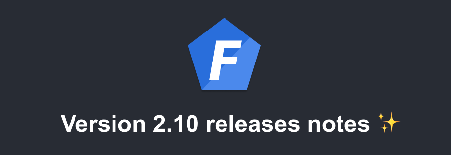

Version 2.10 of [Foal](https://foalts.org/) is out! This small release brings some tiny improvements.

<!--truncate-->

## `@foal/cli` package included by default as dev dependency

Issue: [#1097](https://github.com/FoalTS/foal/issues/1097)

The `@foal/cli` package is now installed by default as dev dependency. In this way, all commands of `package.json` still work when deploying the application to a Cloud provider that does not have the CLI installed globally.

Contributor: [@scho-to](https://github.com/scho-to/)

## Preventing the `npm run develop` command to get stuck on some OS

Issues: [#1022](https://github.com/FoalTS/foal/issues/1022), [#1115](https://github.com/FoalTS/foal/issues/1115)

The `npm run develop` was getting stuck on some OS based on the configuration of the app. This issue is now fixed in new projects. For current applications, you will need to add a `-r` flag to the `package.json` commands using `concurrently`.

## Smaller `main` function

The `main` function that bootstraps the application is now smaller in new projects.
