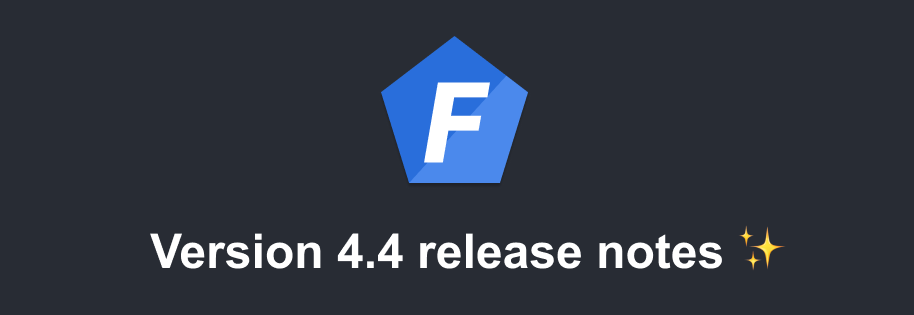

Version 4.4 of [Foal](https://foalts.org/) is out!

<!--truncate-->

This release updates Foal's sub-dependencies, including the `express` library, which presents a moderate vulnerability in versions prior to 4.19.2.

Thanks to [Lucho](https://github.com/lcnvdl) for reporting this vulnerability in the first place!