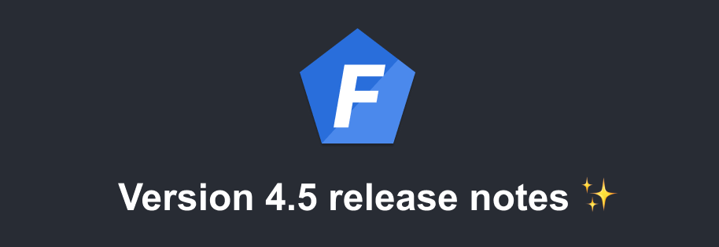

Version 4.5 of [Foal](https://foalts.org/) is out!

<!--truncate-->

## Asynchronous tasks

In some situations, we need to execute a specific task without waiting for it and without blocking the request.

This could be, for example, sending a specific message to the CRM or company chat. In this case, the user needs to be able to see his or her request completed as quickly as possible, even if the request to the CRM takes some time or fails.

To this end, Foal version 4.5 provides an `AsyncService` to execute these tasks asynchronously, and correctly catch and log their errors where appropriate.

```typescript
import { AsyncService, dependency } from '@foal/core';

import { CRMService } from './somewhere';

export class SubscriptionService {
  @dependency
  asyncService: AsyncService;

  @dependency
  crmService: CRMService;

  async subscribe(userId: number): Promise<void> {
    // Do something

    this.asyncService.run(() => this.crmService.updateUser(userId));
  }
}

```

## Social authentication for SPAs

If you wish to manually manage the redirection to the consent page on the client side (which is often necessary when developing an SPA), you can now do so with the `createHttpResponseWithConsentPageUrl` method. It returns an `HttpResponseOK` whose body contains the URL of the consent page.

```typescript
export class AuthController {
  @dependency
  google: GoogleProvider;

  @Get('/signin/google')
  getConsentPageURL() {
    return this.google.createHttpResponseWithConsentPageUrl();
  }
  
  // ...

}

```

## Google social authentification

The typing of the `GoogleProvider` service has been improved. The `userInfo` property returned by `getUserInfo` is now typed with the values returned by the Google server.

```typescript
const { userInfo } = await this.googleProvider.getUserInfo(...);

// userInfo.email, userInfo.family_name, etc
```

## Logging improvements

In previous versions, the util function `displayServerURL` and configuration errors printed logs on several lines, which was not appropriate for logging software.

From version 4.5 onwards, configuration errors are displayed on a single line and the `displayServerURL` function is marked as deprecated.

## CLI fixes

When running `npx foal connect react` to connect the React application to the Foal application in development, the following features did not work:
- Proxify requests from the client to the server without needing to enable CORS or specify a different port in development.
- Build the client application in the server application's public directory.

This is fixed in v4.5.

## Global use of CLI deprecated

In previous versions, the tutorial suggested installing the CLI globally to create a new application or generate files. However, it is considered bad practice to install a dependency globally for local use.

In addition, the CLI was also installed locally so that the build command would work when deploying the application to a CI or to production. This was maintaining two versions of the CLI.

To correct this, in the documentation and examples, the CLI is now always installed and used locally. To use it, simply add `npx` before each command (except for `createapp`).

```bash
# Before
foal createapp my-app

foal generate script foobar
foal createsecret

# After
npx @foal/cli createapp my-app

npx foal generate script foobar
npx foal createsecret
```