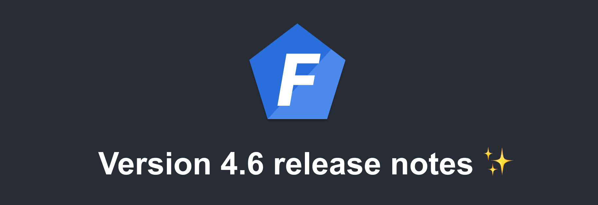

Version 4.6 of [Foal](https://foalts.org/) is out!

<!--truncate-->

## Security update

This release is a security update that removes the deprecated `X-XSS-Protection` header. This header was a feature of Internet Explorer, Chrome and Safari that stopped pages from loading when they detected reflected cross-site scripting (XSS) attacks. But it is now [no longer recommended](https://developer.mozilla.org/en-US/docs/Web/HTTP/Reference/Headers/X-XSS-Protection). In some cases, this header can also create XSS vulnerabilities in otherwise safe websites.

## How to update

To update to version 4.6, run:

```bash
npx foal upgrade 4.6
```

No code changes are required. 