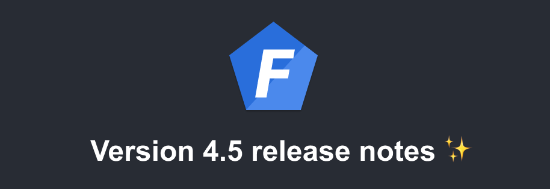

Version 4.5 of [Foal](https://foalts.org/) is out!

<!--truncate-->

## Global use of CLI deprecated

In previous versions, the tutorial suggested installing the CLI globally to create a new application or generate files. However, it is considered bad practice to install a dependency globally for local use.

In addition, the CLI was also installed locally so that the build command would work when deploying the application to a CI or to production. This was maintaining two versions of the CLI.

To correct this, in the documentation and examples, the CLI is now always installed and used locally. To use it, simply add `npx` before each command (except for `createapp`).

```bash
# Before
foal createapp my-app

foal generate script foobar
foal createsecret

# After
npx @foal/cli createapp my-app

npx foal generate script foobar
npx foal createsecret
```