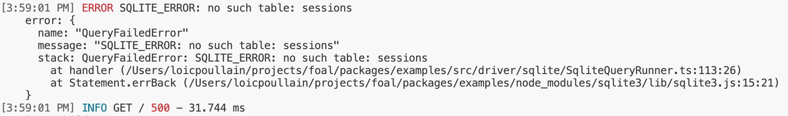
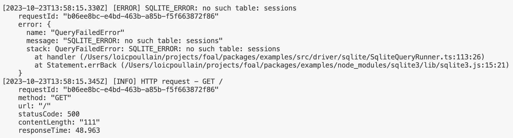

Foal provides an advanced built-in logger. This page shows how to use it.

## Recommended Configuration

*config/development.json*
```json
{
  "settings": {
    "logger": {
      "format": "dev"
    }
  }
}
```

## Accessing and Using the Logger

To log a message anywhere in the application, you can inject the `Logger` service and use its `info` method. This methods takes two parameters:
- a required `message` string,
- and an optional `params` object if you wish to add additional data to the log.

*Example with a controller*
```typescript
import { dependency, Logger, Post } from '@foal/core';

export class AuthController {
  @dependency
  logger: Logger;

  @Post('/signup')
  signup() {
    ...
    this.logger.info('Someone signed up!');
  }

}
```

*Example with a hook*
```typescript
import { Hook, Logger } from '@foal/core';

export function LogUserId() {
  return Hook((ctx, services) => {
    const logger = services.get(Logger);
    logger.info(`Logging user ID`, { userId: ctx.user.id });
  });
}
```

## Levels of Logs

The logger supports four levels of logs:
- the `debug` level which is commonly used to log debugging data,
- the `info` level which logs informative data,
- the `warn` level which logs data that requires attention,
- and the `error` level which logs errors.

*Examples*
```typescript
this.logger.debug('This a debug message');
this.logger.info('This an info message');
this.logger.warn('This a warn message');
this.logger.error('This an error message');

this.logger.log('debug', 'This a debug message');
```

By default, only the `info`, `warn` and `error` messages are logged in the console. If you wish to log all messages, you can update your configuration as follows:

```json
{
  "settings": {
    "logger": {
      "logLevel": "debug"
    }
  }
}
```

| Value of `settings.logger.logLevel` | Levels of logs displayed |
| --- | --- |
| `debug` | error, warn, info, debug |
| `info` | error, warn, info |
| `warn` | error, warn |
| `error` | error |

## Log Ouput Formats

Foal's logger lets you log your messages in three different ways: `raw` (default), `dev` and `json`.

*Example of configuration*
```json
{
  "settings": {
    "logger": {
      "format": "json"
    }
  }
}
```

### The `dev` format

With this format, the logged output contains a small timestamp, beautiful colors and the message. The logger also displays an `error` if one is passed as parameter and it prettifies the HTTP request logs.

This format is adapted to a development environment and focuses on reducing noise.



### The `raw` format

This format aims to log much more information and is suitable for a production environment.

The output contains a complete time stamp, the log level, the message and all parameters passed to the logger if any.



### The `json` format

Similar to the `raw` one, this format prints the same information except that it is displayed with a JSON. This format is useful if you need to diggest the logs with another log tool (such as an aggregator for example).


### Hiding logs: the `none` format

If you wish to completly mask logs, you can use the `none` format.

## HTTP Request Logging

Each request received by Foal is logged with the INFO level.

The messages start with `HTTP request -` and end with the request method and URL. The log parameters include the response status code and content length as well as the response time and the request method and URL.

> Note: the query parameters are not logged to avoid logging sensitive data (such as an API key).

### Adding other parameters to the logs

If the default logged HTTP parameters are not sufficient in your case, you can extend them with the option `getHttpLogParams` in `createApp`:

```typescript
import { createApp, getHttpLogParamsDefault } from '@foal/core';

const app = await createApp({
  getHttpLogParams: (tokens, req, res) => ({
    ...getHttpLogParamsDefault(tokens, req, res),
    myCustomHeader: req.get('my-custom-header'),
  })
})
```

### Disabling HTTP Request Logging

In some scenarios and environments, you might want to disable HTTP request logging. You can achieve this by setting the `logger.logHttpRequests` configuration option to `false`. 

```json
{
  "settings": {
    "logger": {
      "logHttpRequests": false
    }
  }
}
```

## Socket.io Message Logging

Each message, connection or disconnection is logged with the INFO level.

When a client establishes a connection, `Socket.io connection` is logged with the socket ID as parameter.

When a client disconnects, `Socket.io disconnection` is logged with the socket ID and the reason of the disconnection as parameters.

When a message is received, `Socket.io message received - ${eventName}` is logged with the event name and the response status as parameters.

### Disabling Socket.io Message Logging

In some scenarios and environments, you might want to disable socket.io message logging. You can achieve this by setting the `settings.logger.logSocketioMessages` configuration option to `false`. 

```json
{
  "settings": {
    "logger": {
      "logSocketioMessages": false
    }
  }
}
```

## Error Logging

When an error is thrown (or rejected) in a hook, controller or service and is not caught, the error is logged using the `Logger.error` method.

### Disabling Error Logging

In some scenarios, you might want to disable error logging. You can achieve this by setting the `logErrors` configuration option to false. 

```json
{
  "settings": {
    "logErrors": false
  }
}
```

## Log correlation (by HTTP request, user ID, etc)

When logs are generated in large quantities, we often like to aggregate them by request or user. This can be done using Foal's log context.

When receiving an HTTP request, Foal adds the request ID to the logger context. On each subsequent call to the logger, it will behave as if the request ID had been passed as a parameter.

*Example*
```typescript
export class AppController {
  @dependency
  logger: Logger;

  @Get('/foo')
  getFoo(ctx: Context) {
    this.logger.info('Hello world');
    // equivalent to this.logger.info('Hello world', { requestId: ctx.request.id });

    setTimeout(() => {
      this.logger.info('Hello world');
      // equivalent to this.logger.info('Hello world', { requestId: ctx.request.id });
    }, 1000)
    return new HttpResponseOK();
  }
}
```

In the same way, the authentification hooks `@JWTRequired`, `@JWTOptional` and `@UseSessions` will add the `userId` (if any) to the logger context.

When using a Socket.io controller, the socket ID and message ID are also added to the logger context.

This mecanism helps filter logs of a specific request or specific user in a logging tool.

If needed, you call also add manually custom parameters to the logger context with this fonction:
```typescript
logger.addLogContext({ myKey: 'myValue' });
```

## Transports

All logs are printed using the `console.log` function.

If you also wish to consume the logs in another way (for example, to send them to a third-party error-tracking or logging tool), you can add one or more transports to the logger:

```typescript
logger.addTransport((level: 'debug'|'warn'|'info'|'error', log: string) => {
  // Do something
})
```
