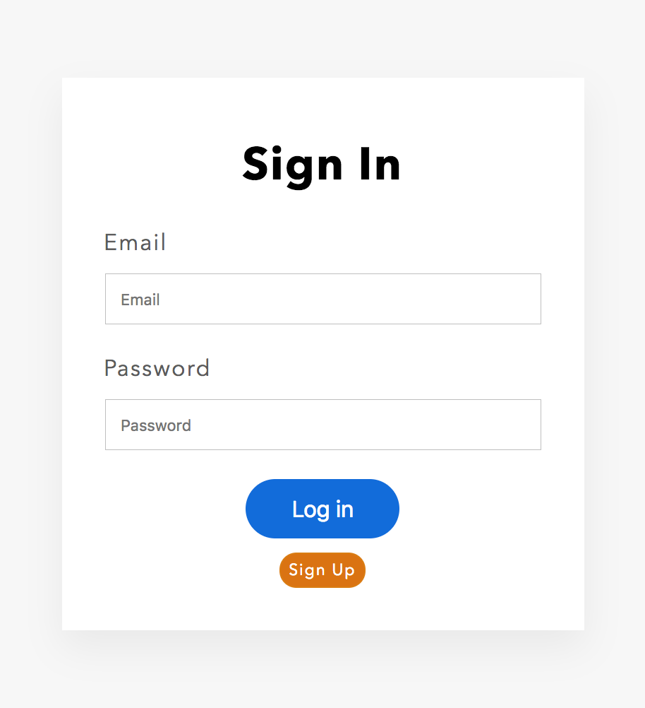

> You are reading the documentation for version 2 of FoalTS. Instructions for upgrading to this version are available [here](../../upgrade-to-v2/README.md). The old documentation can be found [here](https://foalts.org/docs/1.x/).

In this tutorial you will learn how to manage users, authentication and authorization in FoalTS. You will also have a quick overview of end-to-end testing.

For that, you are going to create a multi-user to-do list. It will extend the application created in the previous tutorial [Simple To-Do List](../simple-todo-list/1-installation.md) that you must follow before going through this one.

> The source code of the first tutorial is available [here](https://foalts.org/simple-todo-list-source-code-v2.zip).

The application will have three pages:
- a sign up page where users can create a new account with an email and a password,
- a login page that expects an email and a password to sign in,
- and the todo-list page where the tasks are listed, created and deleted.

Each user will have her/his own todos and will not be able to view, create or delete other people's todos.

The pages look like this:

Let's get started!