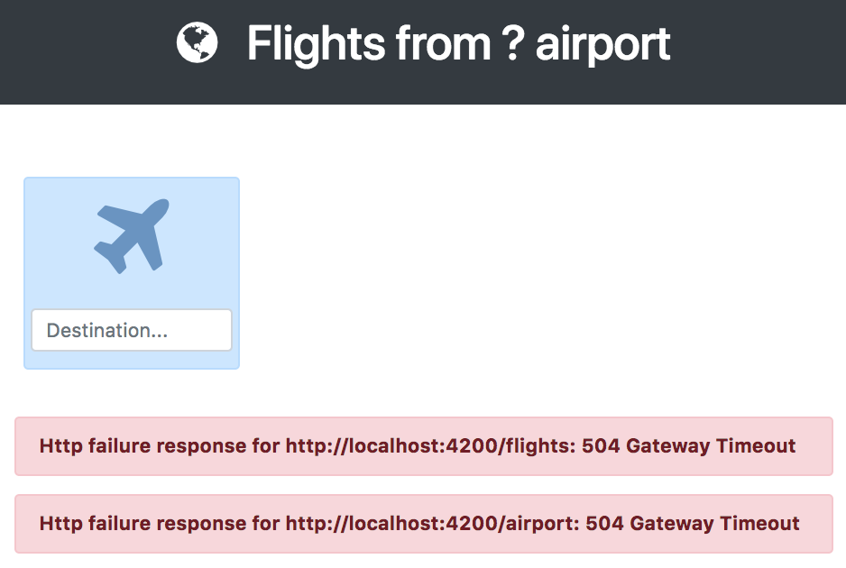

# 1. Introduction

This tutorial will teach you how to create a web app using the core concepts of FoalTS. Through this one you are going to create a board to manage the flights departing from the JFK airport. The page will display the name of the airport, list the flights and let the user add or remove some.

To get started create a new project by following [these instructions](../README.md).

Then [download the frontend app](https://foalts.org/guide-frontend.zip), unzip the bundle and replace the `public/` directory and the `src/app/templates/index.html` template with the downloaded files.

> FoalTS can either interact with rich-client interfaces (Angular, Vue, React, etc) or use classical templating mechanisms. In this tutorial, the frontend part will be handled by a precompiled Angular app.

If you refresh the page at `http://localhost:3000` you should now see this.

> If the server is not running, enter the command `npm run develop` in your console/terminal.

> Some errors should show up in the page. This is perfectly normal as we haven't yet implemented the backend API. If you try to add a flight you'll see another http error displaying.

Now that the front side is set up, let's see what requests it needs the server to handle.

| Description  | Request | Request body | Response body | Status |
| --- | --- | --- | --- | --- |
| Get the airport name  | `GET /airport` | | `{ "name": "JFK" }` | 200 |
| Get all the flights  | `GET /flights` | | `[ { "id": 1, "destination": "CDG" }, { "id": 2, "destination": "CPH" } ]` | 200 |
| Add a new flight | `POST /flights` | `{ "destination": "SFO" }` | `{ "id": 3, "destination": "SFO" }` | 201 |
| Delete flight  | `DELETE /flights/4` | | | 200 or 404 |

Let's handle your first request!
