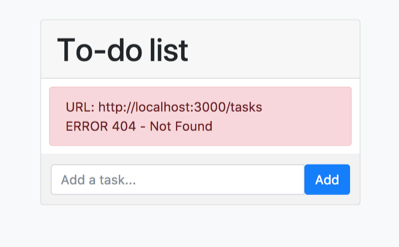

# 1. Introduction

## A Todo-list

This guide covers the basics of `FoalTS`. You will learn how to quickly build a web application using the core concepts of the framework.

For this example you are going to create a todo-app and be taught how to:
- set up a connection database,
- create a model service,
- serve a REST API,
- control input data,
- use several services together,
- and test your components.

The user will be able to:
- add a task,
- mark a task as completed,
- delete a task.

## Prerequities

Before going further you need to install PostgreSQL<!-- or MySQL--> and to [create a new project](../README.md) if it is not already done.

Then [download the frontend code](https://foalts.org/guide-frontend.zip), unzip the bundle and paste all the files in the `public/` directory. You will only focus on the backend of the application in this tutorial.

At this point you should normally see the below interface at `http://localhost:3000`. If it is not, please check that `npm run dev:app` is running properly with no errors.

