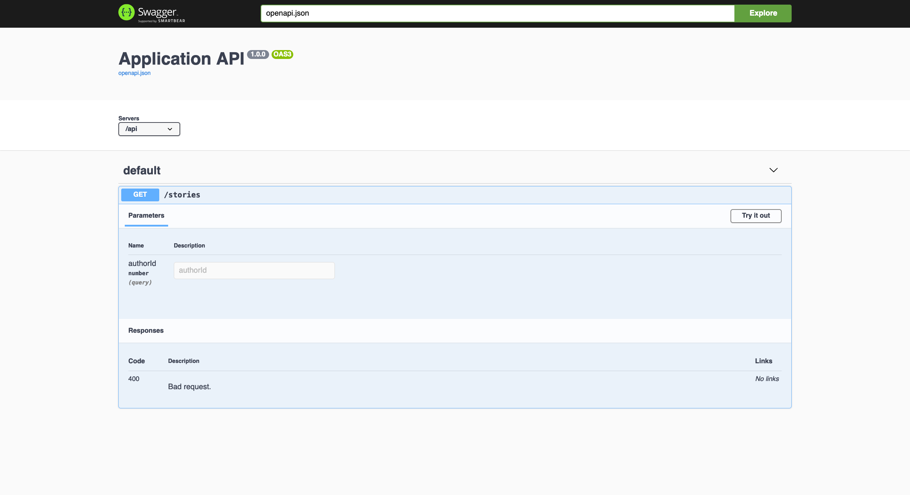

Ahora que se ha implementado el primer punto final de la API, el siguiente paso es probarlo.

Para ello, generará una página de documentación completa de su API desde la que podrá enviar solicitudes. Esta página se generará utilizando [Swagger UI](https://swagger.io/tools/swagger-ui/) y la [especificación OpenAPI](https://github.com/OAI/OpenAPI-Specification/).

```bash
npm install @foal/swagger
```

En primer lugar, proporcione alguna información para describir su API de forma global.

```typescript
import { ApiInfo, ApiServer, controller } from '@foal/core';
import { StoriesController } from './api';

@ApiInfo({
  title: 'Application API',
  version: '1.0.0'
})
@ApiServer({
  url: '/api'
})
export class ApiController {

  subControllers = [
    controller('/stories', StoriesController),
  ];

}

```

A continuación, genere un nuevo controlador. Este se encargará de renderizar la nueva página.

```bash
foal generate controller openapi --register
```

Haga que la clase generada extienda la clase abstracta `SwaggerController`. Y luego proporcione el controlador raíz de su API como una opción al controlador.

```typescript
import { SwaggerController } from '@foal/swagger';
import { ApiController } from './api.controller';

export class OpenapiController extends SwaggerController  {

  options = {
    controllerClass: ApiController
  }

}
```

Por último, actualice su archivo `app.controller.ts` para que la página Swagger UI esté disponible en [/swagger](http://localhost:3001/swagger).

```typescript
import { controller, IAppController } from '@foal/core';

import { ApiController, OpenapiController } from './controllers';

export class AppController implements IAppController {
  subControllers = [
    controller('/api', ApiController),
    controller('/swagger', OpenapiController)
  ];
}

```

Si navega hasta [http://localhost:3001/swagger](http://localhost:3001/swagger), verá la página de documentación generada a partir de su código.



Ahora haga clic en el botón *Try it out*. Los campos se vuelven editables y puede enviar solicitudes para probar su API.

