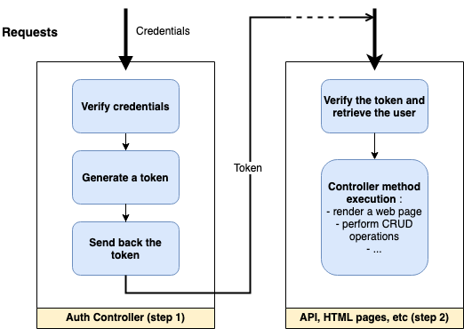

import Tabs from '@theme/Tabs';
import TabItem from '@theme/TabItem';


*Authentication* is the process of verifying that a user is who he or she claims to be. It answers the question *Who is the user?*. 

> *Example: a user enters their login credentials to connect to the application*.

*Authorization*, also known as *Access Control*, is the process of determining what an authenticated user is allowed to do. It answers the question *Does the user has the right to do what they ask?*.

> *Example: a user tries to access the administrator page*.

This document focuses on explaining how authentication works in FoalTS and gives several code examples to get started quickly. Further explanations are given in other pages of the documentation.

## The Basics

The strength of FoalTS authentication system is that it can be used in a wide variety of applications. Whether you want to build a stateless REST API that uses social ID tokens or a traditional web application with templates, cookies and redirects, FoalTS provides you with the tools to do so. You can choose the elements you need and build your own authentication process.

| Auth Support ||
| --- | --- | 
| Kind of Application | API, Regular Web App, SPA+API, Mobile+API |
| State management | Stateful (Session Tokens), Stateless (JSON Web Tokens) |
| Credentials | Passwords, Social |
| Token storage | Cookies, localStorage, Mobile, etc |

Whatever architecture you choose, the authentication process will always follow the same pattern.

**Step 1: the user logs in.**
> *In some architectures, this step might be delegated to an external service: Google, Cognito, Auth0, etc*

1. Verify the credentials (email & password, username & password, social, etc).
1. Generate a token (stateless or stateful).
1. Return the token to the client (in a cookie, in the response body or in a header).

**Step 2: once logged in, the user keeps being authenticated on subsequent requests.**

1. On each request, receive and check the token and retrieve the associated user if the token is valid.



### The Available Tokens (step 1)

FoalTS provides two ways to generate tokens:

- **Session Tokens** (stateful): They are probably the easiest way to manage authentication with Foal. Creation is straightforward, expiration is managed automatically and revocation is easy. Using session tokens keeps your code concise and does not require additional knowledge.

> Unlike other restrictive session management systems, FoalTS sessions are not limited to traditional applications that use cookies, redirection and server-side rendering. You can choose to use sessions without cookies, in a SPA+API or Mobile+API architecture and deploy your application to a serverless environment.

- **JSON Web Tokens** (stateless): For more advanced developers, JWTs can be used to create stateless authentication or authentication that works with external social providers.

### The Authentication Hooks (step 2)

In step 2, the hook `@UseSessions` takes care of checking the session tokens and retrieve their associated user. The same applies to `JWTRequired` and `JWTOptional` with JSON Web Tokens.

You will find more information in the documentation pages dedicated to them.

## Examples

The examples below can be used directly in your application to configure login, logout and signup routes. You can use them as they are or customize them to meet your specific needs.

For these examples, we will use TypeORM as default ORM and emails and passwords as credentials. An API will allow authenticated users to list *products* with the request `GET /api/products`.

The definition of the `User` entity is common to all the examples and is as follows:

*src/app/entities/user.entity.ts*
```typescript
import { BaseEntity, Column, Entity, PrimaryGeneratedColumn } from 'typeorm';

@Entity()
export class User extends BaseEntity {
  @PrimaryGeneratedColumn()
  id: number;

  @Column({ unique: true })
  email: string;

  @Column()
  password: string;
}

// Exporting this line is required
// when using session tokens with TypeORM.
// It will be used by `npm run makemigrations`
// to generate the SQL session table.
export { DatabaseSession } from '@foal/typeorm';
```

### SPA, 3rd party APIs, Mobile (cookies)

> As you use cookies, you must add a [CSRF protection](../security/csrf-protection.md) to your application.

In these implementations, the client does not have to handle the receipt, sending and expiration of the tokens itself. All is handled transparently by the server using cookies.

> *Note: If you develop a native Mobile application, you may need to enable a *cookie* plugin in your code.*

> *Note: If your server and client do not have the same origins, you may also need to enable [CORS requests](../security/cors.md).*

#### Using Session Tokens

First, make sure that the `DatabaseSession` entity is exported in `user.entity.ts`. Then build and run the migrations.

```bash
npm run makemigrations
npm run migrations
```

*src/app/app.controller.ts*
```typescript
import { controller, dependency, IAppController, Store, UseSessions } from '@foal/core';

import { User } from './entities';
import { ApiController, AuthController } from './controllers';

@UseSessions({
  cookie: true,
  user: (id: number) => User.findOneBy({ id }),
})
export class AppController implements IAppController {
  // This line is required.
  @dependency
  store: Store;

  subControllers = [
    controller('/auth', AuthController),
    controller('/api', ApiController),
  ];

}
```

*src/app/controllers/auth.controller.ts*
```typescript
import { Context, hashPassword, HttpResponseOK, HttpResponseUnauthorized, Post, ValidateBody, verifyPassword } from '@foal/core';

import { User } from '../entities';

const credentialsSchema = {
  additionalProperties: false,
  properties: {
    email: { type: 'string', format: 'email' },
    password: { type: 'string' }
  },
  required: [ 'email', 'password' ],
  type: 'object',
};

export class AuthController {

  @Post('/signup')
  @ValidateBody(credentialsSchema)
  async signup(ctx: Context) {
    const user = new User();
    user.email = ctx.request.body.email;
    user.password = await hashPassword(ctx.request.body.password);
    await user.save();

    ctx.session!.setUser(user);
    await ctx.session!.regenerateID();

    return new HttpResponseOK();
  }

  @Post('/login')
  @ValidateBody(credentialsSchema)
  async login(ctx: Context) {
    const user = await User.findOneBy({ email: ctx.request.body.email });

    if (!user) {
      return new HttpResponseUnauthorized();
    }

    if (!await verifyPassword(ctx.request.body.password, user.password)) {
      return new HttpResponseUnauthorized();
    }

    ctx.session!.setUser(user);
    await ctx.session!.regenerateID();

    return new HttpResponseOK();
  }

  @Post('/logout')
  async logout(ctx: Context) {
    await ctx.session!.destroy();

    return new HttpResponseOK();
  }
}
```

*src/app/controllers/api.controller.ts*
```typescript
import { Get, HttpResponseOK, UserRequired } from '@foal/core';

@UserRequired()
export class ApiController {
  @Get('/products')
  readProducts() {
    return new HttpResponseOK([]);
  }
}
```

#### Using JSON Web Tokens

> When using stateless authentication with JWT, you must manage the renewal of tokens after their expiration yourself. You also cannot list all users logged into your application.

First, generate a base64-encoded secret.

```bash
foal createsecret
```

Save this secret in a `.env` file.

```bash
JWT_SECRET="Ak0WcVcGuOoFuZ4oqF1tgqbW6dIAeSacIN6h7qEyJM8="
```

Update your configuration to retrieve the secret.

<Tabs
  defaultValue="yaml"
  values={[
    {label: 'YAML', value: 'yaml'},
    {label: 'JSON', value: 'json'},
    {label: 'JS', value: 'js'},
  ]}
>
<TabItem value="yaml">

```yaml
settings:
  jwt:
    secret: env(JWT_SECRET)
    secretEncoding: base64
```

</TabItem>
<TabItem value="json">

```json
{
  "settings": {
    "jwt": {
      "secret": "env(JWT_SECRET)",
      "secretEncoding": "base64"
    }
  }
}
```

</TabItem>
<TabItem value="js">

```javascript
const { Env } = require('@foal/core');

module.exports = {
  settings: {
    jwt: {
      secret: Env.get("JWT_SECRET"),
      secretEncoding: "base64"
    }
  }
}
```

</TabItem>
</Tabs>

*src/app/app.controller.ts*
```typescript
import { controller, IAppController } from '@foal/core';

import { ApiController, AuthController } from './controllers';

export class AppController implements IAppController {

  subControllers = [
    controller('/auth', AuthController),
    controller('/api', ApiController),
  ];

}
```

*src/app/controllers/auth.controller.ts*
```typescript
import { Context, hashPassword, HttpResponseOK, HttpResponseUnauthorized, Post, ValidateBody, verifyPassword } from '@foal/core';
import { getSecretOrPrivateKey, removeAuthCookie, setAuthCookie } from '@foal/jwt';
import { sign } from 'jsonwebtoken';
import { promisify } from 'util';

import { User } from '../entities';

const credentialsSchema = {
  additionalProperties: false,
  properties: {
    email: { type: 'string', format: 'email' },
    password: { type: 'string' }
  },
  required: [ 'email', 'password' ],
  type: 'object',
};

export class AuthController {

  @Post('/signup')
  @ValidateBody(credentialsSchema)
  async signup(ctx: Context) {
    const user = new User();
    user.email = ctx.request.body.email;
    user.password = await hashPassword(ctx.request.body.password);
    await user.save();

    const response = new HttpResponseOK();
    await setAuthCookie(response, await this.createJWT(user));
    return response;
  }

  @Post('/login')
  @ValidateBody(credentialsSchema)
  async login(ctx: Context) {
    const user = await User.findOneBy({ email: ctx.request.body.email });

    if (!user) {
      return new HttpResponseUnauthorized();
    }

    if (!await verifyPassword(ctx.request.body.password, user.password)) {
      return new HttpResponseUnauthorized();
    }

    const response = new HttpResponseOK();
    await setAuthCookie(response, await this.createJWT(user));
    return response;
  }

  @Post('/logout')
  async logout(ctx: Context) {
    const response = new HttpResponseOK();
    removeAuthCookie(response);
    return response;
  }

  private async createJWT(user: User): Promise<string> {
    const payload = {
      email: user.email,
      id: user.id,
    };
    
    return promisify(sign as any)(
      payload,
      getSecretOrPrivateKey(),
      { subject: user.id.toString() }
    );
  }
}
```

*src/app/controllers/api.controller.ts*
```typescript
import { Get, HttpResponseOK } from '@foal/core';
import { JWTRequired } from '@foal/jwt';

import { User } from './entities';

@JWTRequired({
  cookie: true,
  // Add the line below if you prefer ctx.user
  // to be an instance of User instead of the JWT payload.
  // user: (id: number) => User.findOneBy({ id })
})
export class ApiController {
  @Get('/products')
  readProducts() {
    return new HttpResponseOK([]);
  }
}
```

### SPA, 3rd party APIs, Mobile (Authorization header)

In these implementations, the user logs in with the route `POST /auth/login` and receives a token in exchange in the response body. Then, when the client makes a request to the API, the token must be included in the `Authorization` header using the bearer sheme.

```
Authorization: Bearer my-token
```

> *Note: If your server and client do not have the same origins, you may also need to enable [CORS requests](../security/cors.md).*

#### Using Session Tokens

First, make sure that the `DatabaseSession` entity is exported in `user.entity.ts`. Then build and run the migrations.

```bash
npm run makemigrations
npm run migrations
```

*src/app/app.controller.ts*
```typescript
import { controller, IAppController } from '@foal/core';

import { ApiController, AuthController } from './controllers';

export class AppController implements IAppController {

  subControllers = [
    controller('/auth', AuthController),
    controller('/api', ApiController),
  ];

}
```

*src/app/controllers/auth.controller.ts*
```typescript
import { Context, createSession, dependency, hashPassword, HttpResponseOK, HttpResponseUnauthorized, Post, Store, UseSessions, ValidateBody, verifyPassword } from '@foal/core';

import { User } from '../entities';

const credentialsSchema = {
  additionalProperties: false,
  properties: {
    email: { type: 'string', format: 'email' },
    password: { type: 'string' }
  },
  required: [ 'email', 'password' ],
  type: 'object',
};

@UseSessions()
export class AuthController {
  @dependency
  store: Store;

  @Post('/signup')
  @ValidateBody(credentialsSchema)
  async signup(ctx: Context) {
    const user = new User();
    user.email = ctx.request.body.email;
    user.password = await hashPassword(ctx.request.body.password);
    await user.save();

    ctx.session = await createSession(this.store);
    ctx.session.setUser(user);

    return new HttpResponseOK({
      token: ctx.session.getToken()
    });
  }

  @Post('/login')
  @ValidateBody(credentialsSchema)
  async login(ctx: Context) {
    const user = await User.findOneBy({ email: ctx.request.body.email });

    if (!user) {
      return new HttpResponseUnauthorized();
    }

    if (!await verifyPassword(ctx.request.body.password, user.password)) {
      return new HttpResponseUnauthorized();
    }

    ctx.session = await createSession(this.store);
    ctx.session.setUser(user);

    return new HttpResponseOK({
      token: ctx.session.getToken()
    });
  }

  @Post('/logout')
  async logout(ctx: Context) {
    if (ctx.session) {
      await ctx.session.destroy();
    }

    return new HttpResponseOK();
  }
}
```

*src/app/controllers/api.controller.ts*
```typescript
import { Get, HttpResponseOK, UserRequired, UseSessions } from '@foal/core';

import { User } from '../entities';

// The `request` option returns a pretty message if the Authorization header is not here.
@UseSessions({
  required: true,
  user: (id: number) => User.findOneBy({ id }),
})
@UserRequired()
export class ApiController {
  @Get('/products')
  readProducts() {
    return new HttpResponseOK([]);
  }
}
```


#### Using JSON Web Tokens

> When using stateless authentication with JWT, you must manage the renewal of tokens after their expiration yourself. You also cannot list all users logged into your application.

First, generate a base64-encoded secret.

```bash
foal createsecret
```

Save this secret in a `.env` file.

```bash
JWT_SECRET="Ak0WcVcGuOoFuZ4oqF1tgqbW6dIAeSacIN6h7qEyJM8="
```

Update your configuration to retrieve the secret.

<Tabs
  defaultValue="yaml"
  values={[
    {label: 'YAML', value: 'yaml'},
    {label: 'JSON', value: 'json'},
    {label: 'JS', value: 'js'},
  ]}
>
<TabItem value="yaml">

```yaml
settings:
  jwt:
    secret: env(JWT_SECRET)
    secretEncoding: base64
```

</TabItem>
<TabItem value="json">

```json
{
  "settings": {
    "jwt": {
      "secret": "env(JWT_SECRET)",
      "secretEncoding": "base64"
    }
  }
}
```

</TabItem>
<TabItem value="js">

```javascript
const { Env } = require('@foal/core');

module.exports = {
  settings: {
    jwt: {
      secret: Env.get("JWT_SECRET"),
      secretEncoding: "base64"
    }
  }
}
```

</TabItem>
</Tabs>

*src/app/app.controller.ts*
```typescript
import { controller, IAppController } from '@foal/core';

import { ApiController, AuthController } from './controllers';

export class AppController implements IAppController {

  subControllers = [
    controller('/auth', AuthController),
    controller('/api', ApiController),
  ];

}
```

*src/app/controllers/auth.controller.ts*
```typescript
import { Context, hashPassword, HttpResponseOK, HttpResponseUnauthorized, Post, ValidateBody, verifyPassword } from '@foal/core';
import { getSecretOrPrivateKey } from '@foal/jwt';
import { sign } from 'jsonwebtoken';
import { promisify } from 'util';

import { User } from '../entities';

const credentialsSchema = {
  additionalProperties: false,
  properties: {
    email: { type: 'string', format: 'email' },
    password: { type: 'string' }
  },
  required: [ 'email', 'password' ],
  type: 'object',
};

export class AuthController {

  @Post('/signup')
  @ValidateBody(credentialsSchema)
  async signup(ctx: Context) {
    const user = new User();
    user.email = ctx.request.body.email;
    user.password = await hashPassword(ctx.request.body.password);
    await user.save();

    return new HttpResponseOK({
      token: await this.createJWT(user)
    });
  }

  @Post('/login')
  @ValidateBody(credentialsSchema)
  async login(ctx: Context) {
    const user = await User.findOneBy({ email: ctx.request.body.email });

    if (!user) {
      return new HttpResponseUnauthorized();
    }

    if (!await verifyPassword(ctx.request.body.password, user.password)) {
      return new HttpResponseUnauthorized();
    }

    return new HttpResponseOK({
      token: await this.createJWT(user)
    });
  }

  private async createJWT(user: User): Promise<string> {
    const payload = {
      email: user.email,
      id: user.id,
    };
    
    return promisify(sign as any)(
      payload,
      getSecretOrPrivateKey(),
      { subject: user.id.toString() }
    );
  }
}
```

*src/app/controllers/api.controller.ts*
```typescript
import { Get, HttpResponseOK } from '@foal/core';
import { JWTRequired } from '@foal/jwt';

import { User } from '../entities';

@JWTRequired({
  // Add the line below if you prefer ctx.user
  // to be an instance of User instead of the JWT payload.
  // user: (id: number) => User.findOneBy({ id })
})
export class ApiController {
  @Get('/products')
  readProducts() {
    return new HttpResponseOK([]);
  }
}
```

### SSR Applications (cookies)

> As you use cookies, you must add a [CSRF protection](../security/csrf-protection.md) to your application.

In this implementation, the client does not have to handle the receipt, sending and expiration of the tokens itself. All is handled transparently by the server using cookies and redirections.

#### Using Session Tokens

First, make sure that the `DatabaseSession` entity is exported in `user.entity.ts`. Then build and run the migrations.

```bash
npm run makemigrations
npm run migrations
```

*src/app/app.controller.ts*
```typescript
import { Context, controller, dependency, Get, IAppController, render, Store, UserRequired, UseSessions } from '@foal/core';

import { ApiController, AuthController } from './controllers';
import { User } from './entities';

@UseSessions({
  cookie: true,
  user: (id: number) => User.findOneBy({ id }),
})
export class AppController implements IAppController {
  // This line is required.
  @dependency
  store: Store;

  subControllers = [
    controller('/auth', AuthController),
    controller('/api', ApiController),
  ];

  @Get('/')
  @UserRequired({ redirectTo: '/login' })
  index() {
    return render('./templates/index.html');
  }

  @Get('/login')
  login(ctx: Context) {
    return render('./templates/login.html', {
      errorMessage: ctx.session!.get<string>('errorMessage', '')
    });
  }

}
```

*src/app/controllers/auth.controller.ts*
```typescript
import { Context, hashPassword, HttpResponseRedirect, Post, ValidateBody, verifyPassword } from '@foal/core';

import { User } from '../entities';

const credentialsSchema = {
  additionalProperties: false,
  properties: {
    email: { type: 'string', format: 'email' },
    password: { type: 'string' }
  },
  required: [ 'email', 'password' ],
  type: 'object',
};

export class AuthController {

  @Post('/signup')
  @ValidateBody(credentialsSchema)
  async signup(ctx: Context) {
    const user = new User();
    user.email = ctx.request.body.email;
    user.password = await hashPassword(ctx.request.body.password);
    await user.save();

    ctx.session!.setUser(user);
    await ctx.session!.regenerateID();

    return new HttpResponseRedirect('/');
  }

  @Post('/login')
  @ValidateBody(credentialsSchema)
  async login(ctx: Context) {
    const user = await User.findOneBy({ email: ctx.request.body.email });

    if (!user) {
      ctx.session!.set('errorMessage', 'Unknown email.', { flash: true });
      return new HttpResponseRedirect('/login');
    }

    if (!await verifyPassword(ctx.request.body.password, user.password)) {
      ctx.session!.set('errorMessage', 'Invalid password.', { flash: true });
      return new HttpResponseRedirect('/login');
    }

    ctx.session!.setUser(user);
    await ctx.session!.regenerateID();

    return new HttpResponseRedirect('/');
  }

  @Post('/logout')
  async logout(ctx: Context) {
    await ctx.session!.destroy();

    return new HttpResponseRedirect('/login');
  }
}
```

*src/app/controllers/api.controller.ts*
```typescript
import { Get, HttpResponseOK, UserRequired } from '@foal/core';

@UserRequired()
export class ApiController {
  @Get('/products')
  readProducts() {
    return new HttpResponseOK([]);
  }
}
```

*templates/login.html*
```html
<!DOCTYPE html>
<html lang="en">
<head>
  <meta charset="UTF-8">
  <meta name="viewport" content="width=device-width, initial-scale=1.0">
  <title>Login</title>
</head>
<body>
  {{ errorMessage }}
  <form action="/auth/login" method="post">
    <input type="email" name="email" id="email">
    <input type="password" name="password" id="password">
    <input type="submit" value="Log In">
  </form>
</body>
</html>
```