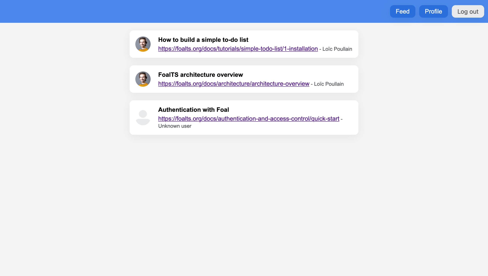
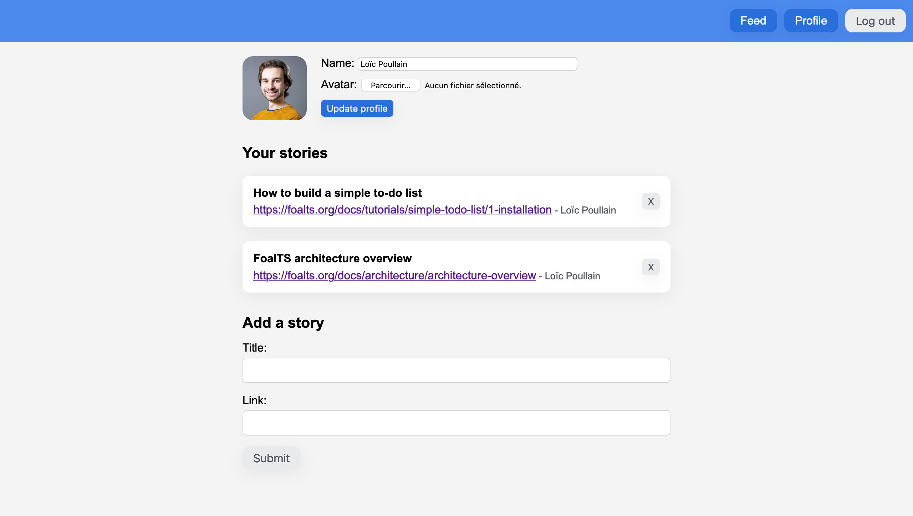
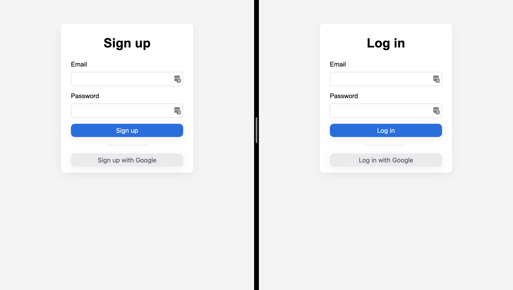

Este tutorial muestra cómo construir una aplicación del mundo real con React y Foal. Asume que ya ha leído la primera guía *[Cómo construir una lista de tareas simple](../simple-todo-list/1-installation.md)* y que tiene un conocimiento básico de React.

En este tutorial, aprenderá a
- establecer una conexión con MySQL o Postgres,
- proporcionar credenciales a la aplicación de forma segura,
- crear modelos con relaciones muchos-a-uno,
- utilizar un constructor de consultas,
- generar una interfaz para probar su API (Swagger UI),
- arreglar los errores de la política del mismo origen,
- permitir que los usuarios se conecten y se registren con un correo electrónico y una contraseña,
- autenticar a los usuarios en el frontend y en el backend,
- gestionar el control de acceso,
- proteger contra los ataques CSRF,
- subir y guardar archivos,
- permitir a los usuarios conectarse con un proveedor social (Google),
- y construir la aplicación para la producción.

> *Para simplificar, la aplicación front-end no utilizará una biblioteca de gestión de estado (como [redux](https://redux.js.org/)). Pero, por supuesto, puede añadir una si lo desea. La lógica a seguir seguirá siendo principalmente la misma.*

## Descripción de la Aplicación

La aplicación que creará es un sitio web social donde los usuarios pueden compartir enlaces interesantes a tutoriales. Todos los posts serán públicos, por lo que no será necesaria la autentificación para verlos. La publicación de un post, en cambio, requerirá la creación de una cuenta.

*Página principal*


*Página de perfil*


*Páginas de registro e inicio de sesión*


## Empezar

Comencemos. En primer lugar, cree un nuevo directorio.

```bash
mkdir foal-react-tuto
```

Genere la aplicación backend.

```bash
cd foal-react-tuto
foal createapp backend-app
```

Luego inicie el servidor de desarrollo.

```bash
cd backend-app
npm run dev
```

Vaya a [http://localhost:3001](http://localhost:3001) en su navegador. Debería ver el mensaje *Welcome on board*.