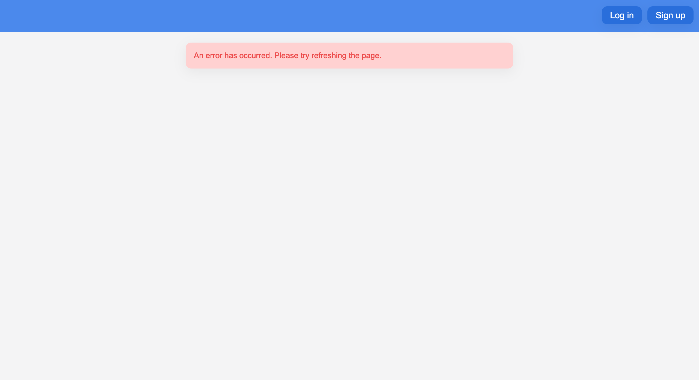

Muy bien, hasta ahora tiene una primera versión de trabajo de su API. Es el momento de añadir el frontend.

Descargue el archivo zip [aquí](./assets/frontend-app.zip). Contiene una base de código para el front-end que irá completando a medida que avance. La mayor parte de la aplicación ya está implementada para usted. Sólo tendrá que ocuparse de la autenticación y de la carga de archivos durante este tutorial.

Cree un nuevo directorio `frontend-app` en la raíz de su proyecto y traslade el contenido del zip a él.

Vaya al directorio recién creado e inicie el servidor de desarrollo.

```bash
cd frontend-app
npm install
npm run start
```

La aplicación frontal se carga en [http://localhost:3000](http://localhost:3000).



La interfaz muestra un error y le pide que actualice la página. Este error se debe a que las aplicaciones del frontend y del backend se sirven en puertos diferentes. Por lo tanto, al enviar una solicitud, el frontend la envía al puerto equivocado.

Una forma de resolver este problema es actualizar temporalmente el archivo `requests/stories.ts` para utilizar el puerto `3001` en desarrollo. Pero esto le obliga a añadir un código diferente al que realmente se utiliza en producción, y también genera errores de *same-origin policy* con los que tendrá que seguir lidiando.

Otra forma de resolver este problema es *conectar* su servidor de desarrollo frontal al puerto 3001 en desarrollo. Esto puede hacerse con el siguiente comando.

```bash
cd ../backend-app
foal connect react ../frontend-app
```

Si reinicia el servidor del frontend, las publicaciones deberían mostrarse correctamente en la página principal (excepto las imágenes).

