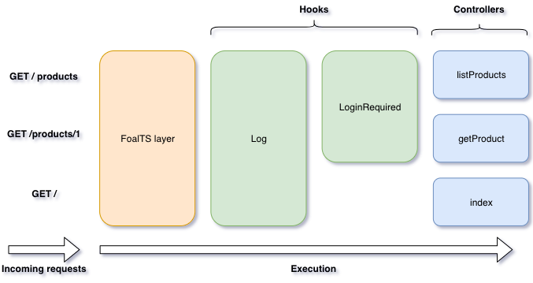

FoalTS is a framework for creating server-side [Node.js](https://nodejs.org) applications. It is written in [TypeScript](https://www.typescriptlang.org/), a typed superset of JavaScript that provides advanced development tools and the latest language features.

FoalTS architecture is organized around three main components: controllers, services and hooks.

## Controllers

Controllers are classes instantiated as singletons. Their methods process the incoming HTTP requests.

```typescript
import { Get, HttpResponseOK } from '@foal/core';

class AppController {

  @Get('/')
  index() {
    return new HttpResponseOK('Hello world!');
  }

}
```

## Services

Services are also classes instantiated as singletons. They are used by the controllers (or hooks) to perform specific tasks.

```typescript
import { dependency, Get, HttpResponseOK } from '@foal/core';

class FormatService {
  withDate(message: string): string {
    return `${new Date()} - ${message}`;
  }
}

class AppController {
  @dependency
  format: FormatService;

  @Get('/')
  index() {
    const message = this.format.withDate('Hello world!');
    return new HttpResponseOK(message);
  }

}
```

## Hooks

Hooks are small functions that add extra logic before or after the execution of a controller method.

```typescript
import { Get, HttpResponseOK } from '@foal/core';
import { JWTRequired } from '@foal/jwt';

class AppController {

  @Get('/')
  @JWTRequired()
  index() {
    return new HttpResponseOK('Hello world!');
  }

}
```

## A Simple Application

Controllers may have sub-controllers. Hooks can be attached to the controllers or their methods. 

Here's an example of what a FoalTS application may look like.

```typescript
import { Context, controller, Get, HttpResponseNotFound, HttpResponseOK, Log } from '@foal/core';
import { JWTRequired } from '@foal/jwt';

@JWTRequired()
class ApiController {
  private products = [
    { id: 1, name: 'phone' },
    { id: 2, name: 'computer' },
  ]

  @Get('/products')
  listProducts() {
    return new HttpResponseOK(this.products);
  }

  @Get('/products/:id')
  getProduct(ctx: Context) {
    const product = this.products.find(
      p => p.id === parseInt(ctx.request.params.id, 10)
    );

    if (!product) {
      return new HttpResponseNotFound();
    }

    return new HttpResponseOK(product);
  }
}

@Log('Receiving a request...')
class AppController {
  subControllers = [
    controller('/api', ApiController)
  ];

  @Get('/')
  index() {
    return new HttpResponseOK('Welcome!');
  }
}
```



