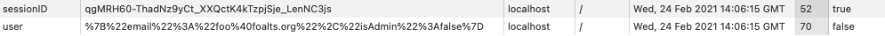

import Tabs from '@theme/Tabs';
import TabItem from '@theme/TabItem';


## Introduction

> This document assumes that you have alread read the [Quick Start](./quick-start.md) page.

In FoalTS, web sessions are temporary states that can be associated with a specific user. They are identified by a token and are mainly used to keep users authenticated between several HTTP requests (the client sends the token on each request to authenticate the user).

A session usually begins when the user logs in (or starts visiting the website) and ends after a period of inactivity or when the user logs out. By inactivity, we mean that the server no longer receives requests from the authenticated user for a certain period of time.

## The Basics

### Choosing a session store

To begin, you must first specify where the session states will be stored. FoalTS provides several *session stores* for this. For example, you can use the `TypeORMStore` to save the sessions in your SQL database or the `RedisStore` to save them in a redis cache.

To do so, the package name of the store must be provided with the configuration key `settings.session.store`.

<Tabs
  defaultValue="yaml"
  values={[
    {label: 'YAML', value: 'yaml'},
    {label: 'JSON', value: 'json'},
    {label: 'JS', value: 'js'},
  ]}
>
<TabItem value="yaml">

```yaml
settings:
  session:
    store: "@foal/typeorm"
```

</TabItem>
<TabItem value="json">

```json
{
  "settings": {
    "session": {
      "store": "@foal/typeorm",
    }
  }
}
```

</TabItem>
<TabItem value="js">

```javascript
module.exports = {
  settings: {
    session: {
      store: "@foal/typeorm",
    }
  }
}
```

</TabItem>
</Tabs>

#### TypeORMStore

```
npm install typeorm@0.3.17 @foal/typeorm
```

This store uses the default TypeORM connection whose configuration is usually specified in `config/default.{json|yml|js}`.

Session states are saved in the `databasesession` table of your SQL database. In order to create it, you need to add and run migrations. For this purpose, you can export the `DatabaseSession` entity in your user file and execute the following commands.

*entities/user.entity.ts*
```typescript
import { DatabaseSession } from '@foal/typeorm';
import { BaseEntity, Entity } from 'typeorm';

@Entity()
export class User extends BaseEntity {
  /* ... */
}

export { DatabaseSession }
```

```
npm run makemigrations
npm run migrations
```

> **Warning**: If you use TypeORM store, then your entity IDs must be numbers (not strings).

#### RedisStore

```
npm install @foal/redis
```

In order to use this store, you must provide the redis URI in the configuration.

<Tabs
  defaultValue="yaml"
  values={[
    {label: 'YAML', value: 'yaml'},
    {label: 'JSON', value: 'json'},
    {label: 'JS', value: 'js'},
  ]}
>
<TabItem value="yaml">

```yaml
settings:
  session:
    store: "@foal/redis"
  redis:
    uri: 'redis://localhost:6379'
```

</TabItem>
<TabItem value="json">

```json
{
  "settings": {
    "session": {
      "store": "@foal/redis",
    },
    "redis": {
      "uri": "redis://localhost:6379"
    }
  }
}
```

</TabItem>
<TabItem value="js">

```javascript
module.exports = {
  settings: {
    session: {
      store: "@foal/redis",
    },
    redis: {
      uri: "redis://localhost:6379"
    }
  }
}
```

</TabItem>
</Tabs>

> If you are using the redis store, please ensure that you have a `@dependency store: Store` property in at least one of your controllers or services. Otherwise, the connection to the redis database will not be established when the application starts.

#### MongoDBStore

```
npm install @foal/mongodb
```

> This package uses the [mongodb Node.JS driver](https://www.npmjs.com/package/mongodb) which uses the [@types/node](https://www.npmjs.com/package/@types/node) package under the hood. If you get type compilation errors, try to upgrade this dependency.

This store saves your session states in a MongoDB database (using the collection `sessions`). In order to use it, you must provide the MongoDB URI in the configuration.

<Tabs
  defaultValue="yaml"
  values={[
    {label: 'YAML', value: 'yaml'},
    {label: 'JSON', value: 'json'},
    {label: 'JS', value: 'js'},
  ]}
>
<TabItem value="yaml">

```yaml
settings:
  session:
    store: "@foal/mongodb"
  mongodb:
    uri: 'mongodb://localhost:27017'
```

</TabItem>
<TabItem value="json">

```json
{
  "settings": {
    "session": {
      "store": "@foal/mongodb",
    },
    "mongodb": {
      "uri": "mongodb://localhost:27017"
    }
  }
}
```

</TabItem>
<TabItem value="js">

```javascript
module.exports = {
  settings: {
    session: {
      store: "@foal/mongodb",
    },
    mongodb: {
      uri: "mongodb://localhost:27017"
    }
  }
}
```

</TabItem>
</Tabs>

> If you are using the MongoDB store, please ensure that you have a `@dependency store: Store` property in at least one of your controllers or services. Otherwise, the connection to the MondoDB database will not be established when the application starts.

### Usage with the `Authorization` header

> This section explains how to use sessions with a `bearer` token and the `Authorization` header. See the section below to see how to use them with cookies.

The mechanism is as follows:

1. Upon login, create the session and assign it to `ctx.session`. Then return the session token in the response.
2. On subsequent requests, send the token in the `Authorization` header with this scheme: `Authorization: Bearer <token>`.

```typescript
import { Context, createSession, dependency, Get, HttpResponseOK, Post, Store, UseSessions } from '@foal/core';

@UseSessions()
export class ApiController {

  @dependency
  store: Store;

  @Post('/login')
  async login(ctx: Context) {
    // Check the user credentials...

    ctx.session = await createSession(this.store);

    // See the "authentication" section below
    // to see how to associate a user to the session.

    return new HttpResponseOK({
      token: ctx.session.getToken()
    });
  }

  @Get('/products')
  readProducts(ctx: Context) {
    // If the request has an Authorization header with a valid token
    // then ctx.session is defined.
    return new HttpResponseOK([]);
  }

}
```

> If the `Authorization` header does not use the `bearer` scheme or if the token is invalid or expired, then the hook returns a 400 or 401 error.

If you want to make sure that `ctx.session` is set and get a 400 error if no `Authorization` header is provided, you can use the `required` option for this.

```typescript
import { Context, createSession, dependency, Get, HttpResponseOK, Post, Store, UseSessions } from '@foal/core';

export class ApiController {

  @dependency
  store: Store;

  @Post('/login')
  @UseSessions()
  async login(ctx: Context) {
    // Check the user credentials...

    ctx.session = await createSession(this.store);

    // See the "authentication" section below
    // to see how to associate a user to the session.

    return new HttpResponseOK({
      token: ctx.session.getToken()
    });
  }

  @Get('/products')
  @UseSessions({ required: true })
  readProducts(ctx: Context) {
    // ctx.session is defined.
    return new HttpResponseOK([]);
  }

}
```

### Usage with cookies

> This section explains how to use sessions with cookies. See the section above to see how to use them with a `bearer` token and the `Authorization` header.

> Be aware that if you use cookies, your application must provide a [CSRF defense](../security/csrf-protection.md).

When using the `@UseSessions` hook with the `cookie` option, FoalTS makes sure that `ctx.session` is always set and takes care of managing the session token on the client (using a cookie).

```typescript
import { Context, dependency, Get, HttpResponseOK, Post, Store, UseSessions } from '@foal/core';

@UseSessions({ cookie: true })
export class ApiController {

  @dependency
  store: Store;

  @Post('/login')
  login(ctx: Context) {
    // Check the user credentials...

    // See the "authentication" section below
    // to see how to associate a user to the session.

    return new HttpResponseOK();
  }

  @Get('/products')
  readProducts(ctx: Context) {
    // ctx.session is defined.
    return new HttpResponseOK([]);
  }

}
```

If the session has expired, the hook returns a 401 error. If you want to redirect the user to the login page, you can use the `redirectTo` option to do so.

```typescript
@UseSessions({
  cookie: true,
  redirectTo: '/login'
})
export class ApiController {

  @Get('/products')
  readProducts(ctx: Context) {
    // ctx.session is defined.
    return new HttpResponseOK([]);
  }

}
```

### Adding authentication and access control

> This section explains how to associate a specific user to a session and how to use `ctx.user`.

Sessions can be used to authenticate users. To do this, you can use the `Session.setUser` method and the `user` option of `@UseSessions`.

```typescript
import { Context, createSession, dependency, Get, HttpResponseOK, Post, Store, UseSessions } from '@foal/core';

import { User } from '../entities';

@UseSessions({
  // If the session is attached to a user,
  // then retrieve the user from the database
  // and assign it to ctx.user
  user: (id: number) => User.findOneBy({ id }),
})
export class ApiController {

  @dependency
  store: Store;

  @Post('/login')
  async login(ctx: Context) {
    // Check the user credentials...
    // const user = ...

    ctx.session = await createSession(this.store);

    // Attach the user to the session.
    ctx.session.setUser(user);

    return new HttpResponseOK({
      token: ctx.session.getToken()
    });
  }

  @Get('/products')
  readProducts(ctx: Context<User>) {
    // If the ctx.session is defined and the session is attached to a user
    // then ctx.user is an instance of User. Otherwise it is null.
    return new HttpResponseOK([]);
  }

}
```

If you want to restrict certain routes to authenticated users, you can use the `@UserRequired` hook for this.

```typescript
import { Context, Get, HttpResponseOK, UserRequired, UseSessions } from '@foal/core';

import { User } from '../entities';

@UseSessions({
  user: (id: number) => User.findOneBy({ id }),
})
export class ApiController {

  @Get('/products')
  @UserRequired()
  readProducts(ctx: Context) {
    // ctx.user is defined.
    return new HttpResponseOK([]);
  }

}
```

If the user is not authenticated, the hook returns a 401 error. If you want to redirect the user to the login page, you can use the `redirectTo` option to do so.

```typescript
import { Context, Get, HttpResponseOK, UserRequired, UseSessions } from '@foal/core';

import { User } from '../entities';

@UseSessions({
  redirectTo: '/login',
  user: (id: number) => User.findOneBy({ id }),
})
export class ApiController {

  @Get('/products')
  @UserRequired({
    redirectTo: '/login'
  })
  readProducts(ctx: Context) {
    // ctx.user is defined.
    return new HttpResponseOK([]);
  }

}
```

### Destroying the session

Sessions can be destroyed (i.e users can be logged out) using their `destroy` method.

```typescript
import { Context, HttpResponseNoContent, Post, UseSessions } from '@foal/core';

export class AuthController {

  @Post('/logout')
  @UseSessions()
  async logout(ctx: Context) {
    if (ctx.session) {
      await ctx.session.destroy();
    }
    return new HttpResponseNoContent();
  }

}
```


## Reading User Information on the Client (cookies)

When building a SPA with cookie-based authentication, it can sometimes be difficult to know if the user is logged in or to obtain certain information about the user (`isAdmin`, etc).

Since the authentication token is stored in a cookie with the `httpOnly` directive set to `true` (to mitigate XSS attacks), the front-end application has no way of knowing if a user is logged in, except by making an additional request to the server.

To solve this problem, Foal provides an option called `userCookie` that allows you to set an additional cookie that the frontend can read with the content you choose. This cookie is synchronized with the session and is refreshed at each request and destroyed when the session expires or when the user logs out.

In the following example, the `user` cookie is empty if no user is logged in or contains certain information about him/her otherwise. This is particularly useful if you need to display UI elements based on user characteristics.

*Server-side code*

```typescript
function userToJSON(user: User|null) {
  if (!user) {
    return 'null';
  }

  return JSON.stringify({
    email: user.email,
    isAdmin: user.isAdmin
  });
}

@UseSessions({
  cookie: true,
  user: (id: number) => User.findOneBy({ id }),
  userCookie: (ctx, services) => userToJSON(ctx.user as User|null)
})
export class ApiController {

  @Get('/products')
  @UserRequired()
  async readProducts(ctx: Context<User>) {
    const products = await Product.findBy({ owner: { id: ctx.user.id } });
    return new HttpResponseOK(products);
  }

}
```

*Cookies*



*Client-side code*

```javascript
const user = JSON.parse(decodeURIComponent(/* cookie value */));
```


## Save and Read Content

You can access and modify the session content with the `set` and `get` methods.

```typescript
import { Context, HttpResponseNoContent, Post, UseSessions } from '@foal/core';

@UseSessions(/* ... */)
export class ApiController {

  @Post('/subscribe')
  subscribe(ctx: Context) {
    const plan = ctx.session!.get<string>('plan', 'free');
    // ...
  }

  @Post('/choose-premium-plan')
  choosePremimumPlan(ctx: Context) {
    ctx.session!.set('plan', 'premium');
    return new HttpResponseNoContent();
  }
}
```

### Flash Content

Sometimes we may wish to store items in the session only for the next request.

For example, when users enter incorrect credentials, they are redirected to the login page, and this time we may want to render the page with a specific message that says "Incorrect email or password". If the user refreshes the page, the message then disappears.

This can be done with flash content. The data will only be available on the next request.

```typescript
ctx.session.set('error', 'Incorrect email or password', { flash: true });
```

## Security

### Session Expiration Timeouts

Session states has two expiration timeouts.

| Timeout | Description | Default value |
| --- | --- | --- |
| Inactivity (or idle) timeout | Period of inactivity after which the session expires. | 15 minutes |
| Absolute timeout | Period after which the session expires, regardless of its activity. | 1 week |

If needed, the default values can be override in the configuration. The timeouts must be provided in seconds.

<Tabs
  defaultValue="yaml"
  values={[
    {label: 'YAML', value: 'yaml'},
    {label: 'JSON', value: 'json'},
    {label: 'JS', value: 'js'},
  ]}
>
<TabItem value="yaml">

```yaml
settings:
  session:
    expirationTimeouts:
      absolute: 2592000 # 30 days
      inactivity: 1800 # 30 min
```

</TabItem>
<TabItem value="json">

```json
{
  "settings": {
    "session": {
      "expirationTimeouts": {
        "absolute": 2592000,
        "inactivity": 1800
      }
    }
  }
}
```

</TabItem>
<TabItem value="js">

```javascript
module.exports = {
  settings: {
    session: {
      expirationTimeouts: {
        absolute: 2592000, // 30 days
        inactivity: 1800 // 30 min
      }
    }
  }
}
```

</TabItem>
</Tabs>


### Revoking Sessions

#### Revoking One Session

```
foal g script revoke-session
```

Open `scripts/revoke-session.ts` and update its content.

```typescript
import { createService, readSession, Store } from '@foal/core';

import { dataSource } from '../db';

export const schema = {
  type: 'object',
  properties: {
    token: { type: 'string' },
  },
  required: [ 'token' ]
}

export async function main({ token }: { token: string }) {
  await dataSource.initialize();

  const store = createService(Store);
  await store.boot();

  const session = await readSession(store, token);
  if (session) {
    await session.destroy();
  }
}
```

Build the script.

```
npm run build
```

Run the script.

```
foal run revoke-session token="lfdkszjanjiznr"
```

#### Revoking All Sessions

```
foal g script revoke-all-sessions
```

Open `scripts/revoke-all-sessions.ts` and update its content.

```typescript
import { createService, Store } from '@foal/core';

import { dataSource } from '../db';

export async function main() {
  await dataSource.initialize();

  const store = createService(Store);
  await store.boot();
  await store.clear();
}
```

Build the script.

```
npm run build
```

Run the script.

```
foal run revoke-all-sessions
```

### Query All Sessions of a User

> *This feature is only available with the TypeORM store.*

```typescript
const user = { id: 1 };
const ids = await store.getSessionIDsOf(user.id);
```

### Query All Connected Users

> *This feature is only available with the TypeORM store.*

```typescript
const ids = await store.getAuthenticatedUserIds();
```

### Force the Disconnection of a User

> *This feature is only available with the TypeORM store.*

```typescript
const user = { id: 1 };
await store.destroyAllSessionsOf(user.id);
```

### Re-generate the Session ID

When a user logs in or change their password, it is a [good practice](https://cheatsheetseries.owasp.org/cheatsheets/Session_Management_Cheat_Sheet.html#renew-the-session-id-after-any-privilege-level-change) to regenerate the session ID. This can be done with the `regenerateID` method.

```typescript
await ctx.session.regenerateID();
```

## Advanced

### Specify the Store Locally

By default, the `@UseSessions` hook and the `Store` service retrieve the store to use from the configuration. This behavior can be override by importing the store directly into the code.

```typescript
import { Context, createSession, dependency, Get, HttpResponseOK, Post, UseSessions } from '@foal/core';
import { RedisStore } from '@foal/redis';

@UseSessions({ store: RedisStore })
export class ApiController {

  @dependency
  store: RedisStore;

  @Post('/login')
  async login(ctx: Context) {
    // Check the user credentials...

    ctx.session = await createSession(this.store);

    return new HttpResponseOK({
      token: ctx.session.getToken()
    });
  }

  @Get('/products')
  readProducts(ctx: Context) {
    return new HttpResponseOK([]);
  }

}
```

### Cleanup Expired Sessions

By default, FoalTS removes expired sessions in `TypeORMStore` and `MongoDBStore` every 50 requests on average. This can be changed with this configuration key:

<Tabs
  defaultValue="yaml"
  values={[
    {label: 'YAML', value: 'yaml'},
    {label: 'JSON', value: 'json'},
    {label: 'JS', value: 'js'},
  ]}
>
<TabItem value="yaml">

```yaml
settings:
  session:
    garbageCollector:
      periodicity: 25
```

</TabItem>
<TabItem value="json">

```json
{
  "settings": {
    "session": {
      "garbageCollector": {
        "periodicity": 25
      }
    }
  }
}
```

</TabItem>
<TabItem value="js">

```javascript
module.exports = {
  settings: {
    session: {
      garbageCollector: {
        periodicity: 25
      }
    }
  }
}
```

</TabItem>
</Tabs>

### Implement a Custom Store

If necessary, you can implement your own session store. This one must inherit the abstract class `SessionStore`.

To use it, your can import it directly in your code (see the section *Specify the Store Locally*) or use a [relative path](../architecture/services-and-dependency-injection.md#abstract-services) in the configuration. In this case, the class must be exported with the name `ConcreteSessionStore`.

```typescript
import { SessionState, SessionStore } from '@foal/core';

class CustomSessionStore extends SessionStore {
  save(state: SessionState, maxInactivity: number): Promise<void> {
    // ...
  }
  read(id: string): Promise<SessionState | null> {
    // ...
  }
  update(state: SessionState, maxInactivity: number): Promise<void> {
    // ...
  }
  destroy(id: string): Promise<void> {
    // ...
  }
  clear(): Promise<void> {
    // ...
  }
  cleanUpExpiredSessions(maxInactivity: number, maxLifeTime: number): Promise<void> {
    // ...
  }
}
```

| Method | Description |
| --- | --- |
| `save` | Saves the session for the first time. If a session already exists with the given ID, a SessionAlreadyExists error MUST be thrown. |
| `read` | Reads a session. If the session does not exist, the value `null` MUST be returned. |
| `update` | Updates and extends the lifetime of a session. If the session no longer exists (i.e. has expired or been destroyed), the session MUST still be saved. |
| `destroy` | Deletes a session. If the session does not exist, NO error MUST be thrown. |
| `clear` | Clears all sessions. |
| `cleanUpExpiredSessions` | Some session stores may need to run periodically background jobs to cleanup expired sessions. This method deletes all expired sessions. If the store manages a cache database, then this method can remain empty but it must NOT throw an error. |

Session stores do not manipulate `Session` instances directly. Instead, they use `SessionState` objects.

```typescript
interface SessionState {
  // 44-characters long
  id: string;
  userId: string|number|null;
  content: { [key: string]: any };
  flash: { [key: string]: any };
  // 4-bytes long (min: 0, max: 2147483647)
  updatedAt: number;
  // 4-bytes long (min: 0, max: 2147483647)
  createdAt: number;
}
```

### Usage with Cookies

#### Do not Auto-Create the Session

By default, when the `cookie` option is set to true, the `@UseSessions` hook automatically creates a session if it does not already exist. This can be disabled with the `create` option.

```typescript
import { Context, createSession, dependency, HttpResponseOK, Post, Store, UseSessions } from '@foal/core';

export class ApiController {
  @dependency
  store: Store;

  @Post('/login')
  @UseSessions({ cookie: true, create: false })
  async login(ctx: Context) {
    // Check the credentials...

    // ctx.session is potentially undefined
    if (!ctx.session) {
      ctx.session = await createSession(this.store);
    }

    return new HttpResponseOK();
  }

}
```

#### Override the Cookie Options

The default session cookie directives can be overridden in the configuration as follows:

<Tabs
  defaultValue="yaml"
  values={[
    {label: 'YAML', value: 'yaml'},
    {label: 'JSON', value: 'json'},
    {label: 'JS', value: 'js'},
  ]}
>
<TabItem value="yaml">

```yaml
settings:
  session:
    cookie:
      name: xxx # default: sessionID
      domain: example.com
      httpOnly: false # default: true
      path: /foo # default: /
      sameSite: lax
      secure: true
```

</TabItem>
<TabItem value="json">

```json
{
  "settings": {
    "session": {
      "cookie": {
        "name": "xxx",
        "domain": "example.com",
        "httpOnly": false,
        "path": "/foo",
        "sameSite": "lax",
        "secure": true
      }
    }
  }
}
```

</TabItem>
<TabItem value="js">

```javascript
module.exports = {
  settings: {
    session: {
      cookie: {
        name: "xxx", // default: sessionID
        domain: "example.com",
        httpOnly: false, // default: true
        path: "/foo", // default: /
        sameSite: "lax",
        secure: true
      }
    }
  }
}
```

</TabItem>
</Tabs>

#### Require the Cookie

In rare situations, you may want to return a 400 error or redirect the user if no session cookie already exists on the client. If so, you can use the `required` option to do so.

```typescript
import { Get, HttpResponseOK, UseSessions } from '@foal/core';

export class ApiController {

  @Get('/products')
  @UseSessions({ cookie: true, required: true })
  readProducts() {
    return new HttpResponseOK([]);
  }

}
```

### Read a Session From a Token

The `@UseSessions` hook automatically retrieves the session state on each request. If you need to manually read a session (for example in a shell script), you can do it with the `readSession` function.

```typescript
import { readSession } from '@foal/core';

const session = await readSession(store, token);
if (!session) {
  throw new Error('Session does not exist or has expired.')
}
const foo = session.get('foo');
```

### Save Manually a Session

The `@UseSessions` hook automatically saves the session state on each request. If you need to manually save a session (for example in a shell script), you can do it with the `commit` method.

```typescript
await session.commit();
```

### Provide A Custom Client to Use in the Stores

By default, the `MongoDBStore` and `RedisStore` create a new client to connect to their respective databases.

This behavior can be overridden by providing a custom client to the stores at initialization.

#### `RedisStore`

```
npm install redis@4
```

*index.ts*
```typescript
import { createApp, ServiceManager } from '@foal/core';
import { RedisStore } from '@foal/redis';
import { createClient } from 'redis';

async function main() {
  const redisClient = createClient({ url: 'redis://localhost:6379' });
  await redisClient.connect();


  const serviceManager = new ServiceManager();
  serviceManager.get(RedisStore).setRedisClient(redisClient);

  const app = await createApp(AppController, { serviceManager });

  // ...
}
```

#### `MongoDBStore`

```
npm install mongodb@5
```

*index.ts*
```typescript
import { createApp, ServiceManager } from '@foal/core';
import { MongoDBStore } from '@foal/mongodb';
import { MongoClient } from 'mongodb';

async function main() {
  const mongoDBClient = await MongoClient.connect('mongodb://localhost:27017/db');

  const serviceManager = new ServiceManager();
  serviceManager.get(MongoDBStore).setMongoDBClient(mongoDBClient);

  const app = await createApp(AppController, { serviceManager });

  // ...
}
```