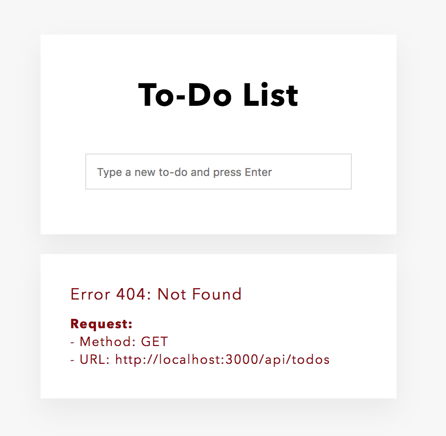

L'application que vous allez créer est une simple liste de tâches. Elle se compose d'une partie frontend qui a déjà été écrite pour vous et d'une partie backend qui sera le sujet de ce tutoriel.

Téléchargez d'abord les fichiers html, css et js en cliquant [ici](https://foalts.org/simple-todo-list.zip).

Placez les fichiers téléchargés et décompressés dans le répertoire statique `public/`.

Le code exécuté dans le navigateur fera des appels API au serveur pour visualiser, créer et supprimer les tâches.

Rafraîchissez la page. Vous devriez maintenant voir ceci :



> Comme vous n'avez pas encore implémenté l'API du serveur, le frontend obtient une erreur lors de la récupération des tâches. Elle est affichée en bas de la page. Si vous essayez de taper quelque chose dans le champs de texte et que vous appuyez sur la touche Entrée pour créer une nouvelle tâche, vous obtiendrez également une erreur.

Voyons les détails de l'API que nous voulons construire.

**Lister les tâches**
- Requête:
  - méthode: `GET`
  - chemin: `/api/todos`
- Réponse:
  - status: 200 (OK)
  - corps: 
    ```json
    [
      { "id": 1, "text": "Task 1" },
      { "id": 2, "text": "Task 2" },
    ]
    ```

**Créer une tâche**
- Requête:
  - méthode: `POST`
  - chemin: `/api/todos`
  - corps:
    ```json
    {
      "text": "Task 3"
    }
    ```
- Réponse:
  - status: 201 (Created)
  - corps: 
    ```json
    {
      "id": 3,
      "text": "Task 3"
    }
    ```

**Supprimer une tâche**
- Requête:
  - méthode: `DELETE`
  - chemin: `/api/todos/3`
- Réponse:
  - status: 204 (No Content)
