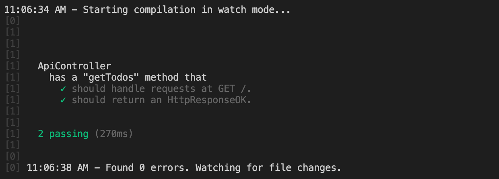

La dernière étape de ce tutoriel consiste à ajouter des tests unitaires à l'`ApiController`.

Un fichier de test unitaire se termine par l'extension `spec.ts` et est généralement placé à côté du fichier qu'il teste.

Ouvrez le fichier `api.controller.spec.ts` et remplacez son contenu.

```typescript
// std
// The `assert` module provides a simple set of assertion tests.
import { ok, strictEqual } from 'assert';

// 3p
import { createController, getHttpMethod, getPath, isHttpResponseOK } from '@foal/core';
import { DataSource } from 'typeorm';

// App
import { Todo } from '../entities';
import { ApiController } from './api.controller';
import { createDataSource } from '../../db';

// Define a group of tests.
describe('ApiController', () => {

  let dataSource: DataSource;
  let controller: ApiController;

  // Create a connection to the database before running all the tests.
  before(async () => {
    // The connection uses the configuration defined in the file config/test.json.
    // By default, the file has three connection options:
    // - "database": "./test_db.sqlite3" -> Use a different database for running the tests.
    // - "synchronize": true ->  Auto create the database schema when the connection is established.
    // - "dropSchema": true -> Drop the schema when the connection is established (empty the database).
    dataSource = createDataSource();
    await dataSource.initialize();
  });

  // Close the database connection after running all the tests whether they succeed or failed.
  after(async () => {
    if (dataSource) {
      await dataSource.close();
    }
  });

  // Create or re-create the controller before each test.
  beforeEach(() => controller = createController(ApiController));

  // Define a nested group of tests.
  describe('has a "getTodos" method that', () => {

    // Define a unit test.
    it('should handle requests at GET /todos.', () => {
      // Throw an error and make the test fail if the HTTP method of `getTodos` is not GET.
      strictEqual(getHttpMethod(ApiController, 'getTodos'), 'GET');
      // Throw an error and make the test fail if the path of `getTodos` is not /todos.
      strictEqual(getPath(ApiController, 'getTodos'), '/todos');
    });

    // Define a unit test.
    it('should return an HttpResponseOK.', async () => {
      // Create fake todos.
      const todo1 = new Todo();
      todo1.text = 'Todo 1';

      const todo2 = new Todo();
      todo2.text = 'Todo 2';

      // Save the todos.
      await Todo.save([ todo1, todo2 ]);

      const response = await controller.getTodos();
      ok(isHttpResponseOK(response), 'response should be an instance of HttpResponseOK.');

      const body = response.body;

      ok(Array.isArray(body), 'The body of the response should be an array.');
      strictEqual(body[0].text, 'Todo 1');
      strictEqual(body[1].text, 'Todo 2');
    });

  });

});

```

> Comme une méthode de contrôle renvoie un objet `HttpResponse`, il est très facile de tester le statut et le corps de la réponse.


> Si la méthode du contrôleur prend un objet `Context` comme argument, vous pouvez en instancier un comme ceci : `new Context({ /* content of the express request object */})`.

Exécutez les tests.

```
npm run test
```

> Cette commande surveille vos tests et vos fichiers testés dans les répertoires `app/` et `scripts/`. Lorsqu'un fichier est modifié, elle recompile et relance automatiquement vos tests.

Vous devriez maintenant vous retrouver avec cette sortie :



Félicitations ! Vous avez atteint la fin de ce tutoriel !

Si vous avez des questions, n'hésitez pas à ouvrir une issue sur Github !

> Le code source complet est disponible [ici](https://foalts.org/simple-todo-list-source-code-v3.zip).