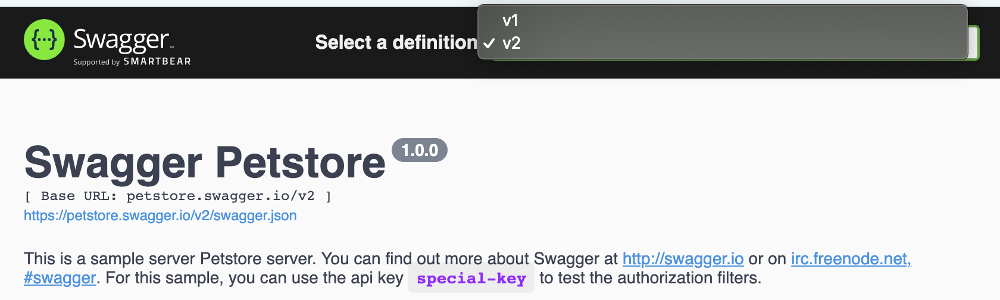

import Tabs from '@theme/Tabs';
import TabItem from '@theme/TabItem';

## Introduction

**OpenAPI Specification** (formerly known as Swagger Specification) is an API description format for REST APIs. An OpenAPI *document* allows developers to describe entirely an API.

**Swagger UI** is a graphical interface to visualize and interact with the API’s resources. It is automatically generated from one or several OpenAPI documents.

*[Example of OpenAPI document and Swagger Visualisation](https://editor.swagger.io/)*

## Quick Start

> *This example shows how to generate a documentation page of your API directly from your hooks and controllers.*

*app.controller.ts*
```typescript
import { controller } from '@foal/core';

import { ApiController, OpenApiController } from './controllers';

export class AppController {
  subControllers = [
    controller('/api', ApiController),
    controller('/swagger', OpenApiController),
  ]
}
```

*api.controller.ts*
```typescript
import { ApiInfo, ApiServer, Context, Post, ValidateBody } from '@foal/core';
import { JWTRequired } from '@foal/jwt';

@ApiInfo({
  title: 'A Great API',
  version: '1.0.0'
})
@ApiServer({
  url: '/api'
})
@JWTRequired()
export class ApiController {

  @Post('/products')
  @ValidateBody({
    type: 'object',
    properties: {
      name: { type: 'string' }
    },
    required: [ 'name' ],
    additionalProperties: false,
  })
  createProduct(ctx: Context) {
    // ...
  }

}
```

*openapi.controller.ts*
```typescript
import { SwaggerController } from '@foal/swagger';

import { ApiController } from './api.controller';

export class OpenApiController extends SwaggerController {
  options = { controllerClass: ApiController };
}
```

**Result**


## OpenAPI

### The Basics

The first thing to do is to add the `@ApiInfo` decorator to the root controller of the API. Two attributes are required: the `title` and the `version` of the API.

```typescript
import { ApiInfo } from '@foal/core';

@ApiInfo({
  title: 'A Great API',
  version: '1.0.0'
})
// @ApiServer({
//   url: '/api'
// })
export class ApiController {
  // ...
}
```

Then each controller method can be documented with the `@ApiOperation` decorator.

```typescript
import { ApiOperation, Get } from '@foal/core';

// ...
export class ApiController {
  @Get('/products')
  @ApiOperation({
    responses: {
      200: {
        content: {
          'application/json': {
            schema: {
              items: {
                properties: {
                  name: { type: 'string' }
                },
                type: 'object',
                required: [ 'name' ]
              },
              type: 'array',
            }
          }
        },
        description: 'successful operation'
      }
    },
    summary: 'Return a list of all the products.'
  })
  readProducts() {
    // ...
  }
}
```

Beside the `@ApiOperation` decorator, you can also use other decorators more specific to improve the readability of the code.

| Operation Decorators |
| --- |
| `@ApiOperationSummary` |
| `@ApiOperationId` |
| `@ApiOperationDescription` |
| `@ApiServer` |
| `@ApiRequestBody` |
| `@ApiSecurityRequirement` |
| `@ApiDefineTag` |
| `@ApiExternalDoc` |
| `@ApiUseTag` |
| `@ApiParameter` |
| `@ApiResponse` |
| `@ApiCallback` |

*Example*

```typescript
import { ApiOperation, ApiResponse, Get } from '@foal/core';
// ...
export class ApiController {

  @Get('/products')
  @ApiOperation({
    responses: {
      200: {
        description: 'successful operation'
      },
      404: {
        description: 'not found'
      },
    }
  })
  readProducts() {
    // ...
  }

  // is equivalent to

  @Get('/products')
  @ApiResponse(200, { description: 'successful operation' })
  @ApiResponse(404, { description: 'not found' })
  readProducts() {
    // ...
  }

}
```

### Don't Repeat Yourself and Decorate Sub-Controllers

Large applications can have many subcontrollers. FoalTS automatically resolves the paths for you and allows you to share common specifications between several operations.

*Example*
```typescript
import { ApiDeprecated, ApiInfo, ApiResponse, controller, Get } from '@foal/core';

@ApiInfo({
  title: 'A Great API',
  version: '1.0.0'
})
export class ApiController {
  subControllers = [
    controller('/products', ProductController)
  ];
}

// All the operations of this controller and
// its subcontrollers should be deprecated.
@ApiDeprecated()
class ProductController {

  @Get()
  @ApiResponse(200, { description: 'successful operation' })
  readProducts() {
    // ...
  }

  @Get('/:productId')
  @ApiResponse(200, { description: 'successful operation' })
  @ApiResponse(404, { description: 'not found' })
  readProduct() {
    // ...
  }

}
```

The generated document will then look like this:

```yaml
openapi: 3.0.0
info:
  title: 'A Great API'
  version: 1.0.0
paths:
  /products: # The path is computed automatically
    get:
      deprecated: true # The operation is deprecated
      responses:
        200:
          description: successful operation
  /products/{productId}: # The path is computed automatically
    get:
      deprecated: true # The operation is deprecated
      responses:
        200:
          description: successful operation
        404:
          description: not found
```

### Use Existing Hooks

The addition of these decorators can be quite redundant with existing hooks. For example, if we want to write OpenAPI documentation for authentication and validation of the request body, we may end up with something like this.

```typescript
@JWTRequired()
@ApiSecurityRequirement({ bearerAuth: [] })
@ApiDefineSecurityScheme('bearerAuth', {
  type: 'http',
  scheme: 'bearer',
  bearerFormat: 'JWT'
})
export class ApiController {
  
  @Post('/products')
  @ValidateBody(schema)
  @ApiRequestBody({
     required: true,
     content: {
       'application/json': { schema }
     }
  })
  createProducts() {
    
  }

}
```

To avoid this, the framework hooks already expose an API specification which is directly included in the generated OpenAPI document.

```typescript
@JWTRequired()
export class ApiController {
  
  @Post('/products')
  @ValidateBody(schema)
  createProducts() {
    // ...
  }

}
```

You can disable this behavior globally with the [configuration key](../architecture/configuration.md) `setting.openapi.useHooks`.

<Tabs
  defaultValue="yaml"
  values={[
    {label: 'YAML', value: 'yaml'},
    {label: 'JSON', value: 'json'},
    {label: 'JS', value: 'js'},
  ]}
>
<TabItem value="yaml">

```yaml
settings:
  openapi:
    useHooks: false
```

</TabItem>
<TabItem value="json">

```json
{
  "settings": {
    "openapi": {
      "useHooks": false
    }
  }
}
```

</TabItem>
<TabItem value="js">

```js
module.exports = {
  settings: {
    openapi: {
      useHooks: false
    }
  }
}
```

</TabItem>
</Tabs>

You can also disable it on a specific hook with the `openapi` option.

```typescript
export class ApiController {
  
  @Post('/products')
  // Generate automatically the OpenAPI spec for the request body
  @ValidateBody(schema)
  // Choose to write a customize spec for the path parameters
  @ValidateParams(schema2, { openapi: false })
  @ApiParameter( ... )
  createProducts() {
    // ...
  }

}
```

### Generate the API Document

Once the controllers are decorated, there are several ways to generate the OpenAPI document.


#### from the controllers

Documents can be retrieved with the `OpenApi` service:

```typescript
import { dependency, OpenApi } from '@foal/core';

class Service {
  @dependency
  openApi: OpenApi;

  foo() {
    const document = this.openApi.getDocument(ApiController);
  }
}

```

#### from a shell script

```
foal generate script generate-openapi-doc
```

The `createOpenApiDocument` function can also be used in a shell script to generate the document. You can provide it with an optional serviceManager if needed.

> *Note that this function instantiates the controllers. So if you have logic in your constructors, you may prefer to put it in `init` methods.*

*src/scripts/generate-openapi-doc.ts*
```typescript
// std
import { writeFileSync } from 'fs';

// 3p
import { createOpenApiDocument } from '@foal/core';
import { stringify } from 'yamljs';

// App
import { ApiController } from '../app/controllers';

export async function main() {
  const document = createOpenApiDocument(ApiController);
  const yamlDocument = stringify(document);

  writeFileSync('openapi.yml', yamlDocument, 'utf8');
}

```

```bash
npm run build
foal run generate-openapi-doc
```


#### Using the Swagger UI controller

Another alternative is to use the  [SwaggerController](#Swagger%20UI) directly. This allows you to serve the document(s) at `/openapi.json` and to use it (them) in a Swagger interface.

## Swagger UI


```
npm install @foal/swagger
```

### Simple case

*app.controller.ts*
```typescript
import { ApiController, OpenApiController } from './controllers';

export class AppController {
  subControllers = [
    controller('/api', ApiController),
    controller('/swagger', OpenApiController)
  ]
}
```

*open-api.controller.ts*
```typescript
import { SwaggerController } from '@foal/swagger';

import { ApiController } from './api.controller';

export class OpenApiController extends SwaggerController {
  options = { controllerClass: ApiController };
}

```

Opening the browser at the path `/swagger` will display the documentation of the `ApiController`.

### With an URL

If needed, you can also specify the URL of a custom OpenAPI file (YAML or JSON).

```typescript
import { SwaggerController } from '@foal/swagger';

export class OpenApiController extends SwaggerController {
  options = { url: 'https://petstore.swagger.io/v2/swagger.json' };
}

```

### Several APIs or Versions

Some applications may serve several APIs (for example two versions of a same API). Here is an example on how to handle this.



*app.controller.ts*
```typescript
import { controller } from '@foal/core';

import { ApiV1Controller, ApiV2ontroller, OpenApiController } from './controllers';

export class AppController {
  subControllers = [
    controller('/api', ApiV1Controller),
    controller('/api2', ApiV2Controller),
    controller('/swagger', OpenApiController),
  ]
}
```

*open-api.controller.ts*
```typescript
import { SwaggerController } from '@foal/swagger';

import { ApiV1Controller } from './api-v1.controller';
import { ApiV2Controller } from './api-v2.controller';

export class OpenApiController extends SwaggerController {
  options = [
    { name: 'v1', controllerClass: ApiV1Controller },
    { name: 'v2', controllerClass: ApiV2Controller, primary: true },
  ]
}
```

### Using a Static File

If you prefer to write manually your OpenAPI document, you can add an `openapi.yml` file in the `public/` directory and configure your `SwaggerController` as follows:

```typescript
import { SwaggerController } from '@foal/swagger';

export class OpenApiController extends SwaggerController {
  options = { url: '/openapi.yml' };
}

```

## Advanced

### Using Controller Properties

```typescript
import { ApiRequestBody, IApiRequestBody, Post } from '@foal/core';

class ApiController {

  requestBody: IApiRequestBody = {
    content: {
      'application/json': {
        schema: {
          type: 'object'
        }
      }
    },
    required: true
  };

  @Post('/products')
  // This is invalid:
  // @ApiRequestBody(this.requestBody)
  // This is valid:
  @ApiRequestBody(controller => controller.requestBody)
  createProduct() {
    // ...
  }

}
```

### In-Depth Overview

- FoalTS automatically resolves the path items and operations based on your controller paths.

*Example*

```typescript
import { ApiResponse, Get, Post } from '@foal/core';

@ApiInfo({
  title: 'A Great API',
  version: '1.0.0'
})
export class ApiController {

  @Get('/products')
  @ApiResponse(200, { description: 'successful operation' })
  readProducts() {
    // ...
  }

  @Post('/products')
  @ApiResponse(200, { description: 'successful operation' })
  createProduct() {
    // ...
  }

}
```

```yaml
openapi: 3.0.0
info:
  title: 'A Great API'
  version: 1.0.0
paths:
  /products: # Foal automatically puts the "get" and "post" operations under the same path item as required by OpenAPI rules.
    get:
      responses:
        200:
          description: successful operation
    post:
      responses:
        200:
          description: successful operation
```

- The decorators `@ApiServer`, `@ApiSecurityRequirement` and `@ApiExternalDocs` have a different behavior depending on if they decorate the root controller or a subcontroller / a method.

*Example with the root controller*

```typescript
import { ApiResponse, ApiServer } from '@foal/core';

@ApiInfo({
  title: 'A Great API',
  version: '1.0.0'
})
@ApiServer({ url: 'http://example.com' })
export class ApiController {

  // ...

}
```

```yaml
openapi: 3.0.0
info:
  title: 'A Great API'
  version: 1.0.0
paths:
  # ...
servers:
- url: http://example.com
```

*Example with a subcontroller / a method*

```typescript
import { ApiResponse, ApiServer, Get } from '@foal/core';

@ApiInfo({
  title: 'A Great API',
  version: '1.0.0'
})
export class ApiController {

  @Get('/')
  @ApiServer({ url: 'http://example.com' })
  @ApiResponse(200, { description: 'successful operation' })
  index() {
    // ...
  }

}
```

```yaml
openapi: 3.0.0
info:
  title: 'A Great API'
  version: 1.0.0
paths:
  /:
    get:
      responses:
        200:
          description: successful operation
      servers:
      - url: http://example.com
```

### Define and Reuse Components

OpenAPI allows you to define and reuse components. Here is a way to achieve this with Foal.

```typescript
import { ApiInfo, ApiDefineSchema, Get } from '@foal/core';

@ApiInfo({
  title: 'A Great API',
  version: '1.0.0'
})
@ApiDefineSchema('product', {
  type: 'object',
  properties: {
    name: { type: 'string' }
  }
  required: [ 'name' ]
})
export class ApiController {

  @Get('/products/:productId')
  @ApiResponse(200, {
    description: 'successful operation'
    content: {
      'application/json': {
        schema: { $ref: '#/components/schemas/product' }
      }
    }
  })
  readProducts() {
    // ...
  }

  @Get('/products')
  @ApiResponse(200, {
    description: 'successful operation',
    content: {
      'application/json': {
        schema: {
          type: 'array',
          items: { $ref: '#/components/schemas/product' }
        }
      }
    }
  })
  readProducts() {
    // ...
  }

}
```

| Component Decorators |
| --- |
| `@ApiDefineSchema` |
| `@ApiDefineResponse` |
| `@ApiDefineParameter` |
| `@ApiDefineExample` |
| `@ApiDefineRequestBody` |
| `@ApiDefineHeader` |
| `@ApiDefineSecurityScheme` |
| `@ApiDefineLink` |
| `@ApiDefineCallback` |

>  The `@ApiDefineXXX` decorators can be added to any controllers or methods but they always define components in the global scope of the API the controller belongs to.

--

> The schemas defined with these decorators can also be re-used in the `@ValidateXXX` hooks.
> ```typescript
> const productSchema = {
>   // ...
> }
> 
> @ApiDefineSchema('product', productSchema)
> @ValidateBody({
>   $ref: '#/components/schemas/product'
> })
> ```

### Generate and Save a Specification File with a Shell Script

```
foal generate script generate-openapi-doc
```

*src/scripts/generate-openapi-doc.ts*
```typescript
// std
import { writeFileSync } from 'fs';

// 3p
import { createOpenApiDocument } from '@foal/core';
import { stringify } from 'yamljs';

// App
import { ApiController } from '../app/controllers';

export async function main() {
  const document = createOpenApiDocument(ApiController);
  const yamlDocument = stringify(document);

  writeFileSync('openapi.yml', yamlDocument, 'utf8');
}

```

```
npm run build
foal run generate-openapi-doc
```

### Common Errors

```typescript
// ...
export class ApiController {
  @Get('/products/:id')
  getProduct() {
    return new HttpResponseOK();
  }

  @Put('/products/:productId')
  updateProduct() {
    return new HttpResponseOK();
  }
}
```

This example will throw this error.

```
Error: Templated paths with the same hierarchy but different templated names MUST NOT exist as they are identical.
  Path 1: /products/{id}
  Path 2: /products/{productId}
```

OpenAPI does not support paths that are identical with different parameter names. Here is a way to solve this issue:

```typescript
// ...
export class ApiController {
  @Get('/products/:productId')
  getProduct() {
    return new HttpResponseOK();
  }

  @Put('/products/:productId')
  updateProduct() {
    return new HttpResponseOK();
  }
}
```

### Extend Swagger UI options

[Swagger UI options](https://swagger.io/docs/open-source-tools/swagger-ui/usage/configuration/) can be extended using the `uiOptions` property.

*Example*
```typescript
import { SwaggerController } from '@foal/swagger';

import { ApiController } from './api.controller';

export class OpenApiController extends SwaggerController {
  options = { controllerClass: ApiController };

  uiOptions = { docExpansion: 'full' };
}

```
