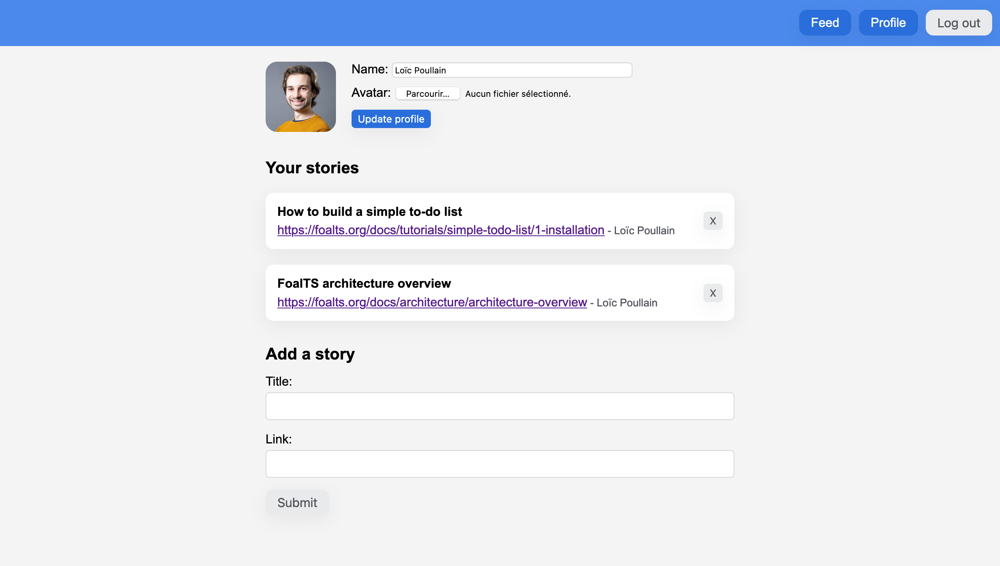
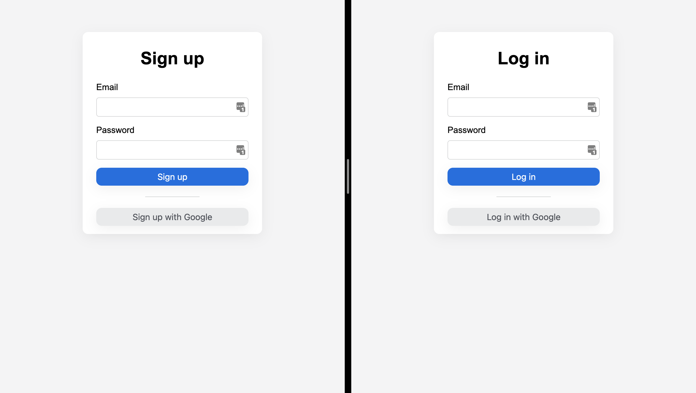

This tutorial shows how to build a real-world application with React and Foal. It assumes that you have already read the first guide *[How to build a Simple To-Do List](../simple-todo-list/1-installation.md)* and that you have a basic knowledge of React.

In this tutorial, you will learn to:
- establish a connection with MySQL or Postgres,
- provide credentials to the application in a secure way,
- create models with many-to-one relations,
- use a query builder,
- generate an interface to test your API (Swagger UI),
- fix same-origin policy errors,
- allow users to log in and register with an email and a password,
- authenticate users on the frontend and the backend,
- manage access control,
- protect against CSRF attacks,
- upload and save files,
- allow users to connect with a social provider (Google),
- and build the application for production.

> *For the sake of simplicity, the front-end application will not use a state management library (such as [redux](https://redux.js.org/)). But you can of course add one if you wish. The logic to follow will remain mainly the same.*

## Application Overview

The application you will create is a social website where users can share interesting links to tutorials. All posts will be public, so no authentication will be required to view them. Publishing a post, on the other hand, will require the creation of an account.

*Feed page*


*Profile page*


*Registration and login pages*


## Get Started

Let's get started. First of all, create a new directory.

```bash
mkdir foal-react-tuto
```

Generate the backend application.

```bash
cd foal-react-tuto
foal createapp backend-app
```

Then start the development server.

```bash
cd backend-app
npm run dev
```

Go to [http://localhost:3001](http://localhost:3001) in your browser. You should see the *Welcome on board* message.