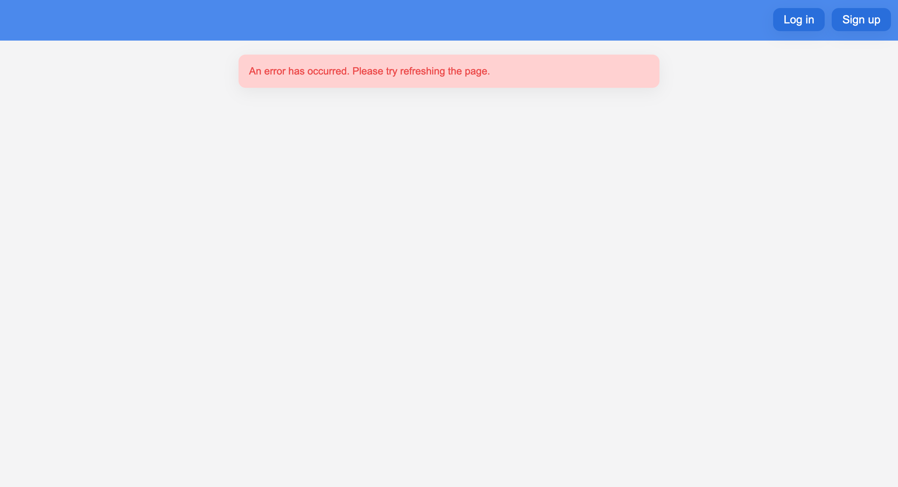
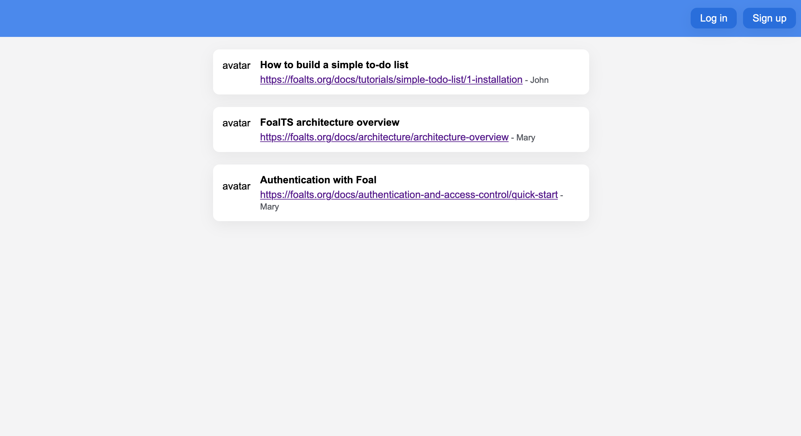

Very good, so far you have a first working version of your API. It's time to add the frontend.

Download the zip file [here](./assets/frontend-app.zip). It contains a front-end code base that you will complete as you go along. Most of the application is already implemented for you. You will only have to deal with authentication and file uploads during this tutorial.

Create a new directory `frontend-app` at the root of your project and move the contents of the zip into it.

Go to the newly created directory and start the development server.

```bash
cd frontend-app
npm install
npm run start
```

The frontend application loads at [http://localhost:3000](http://localhost:3000).



The interface displays an error and prompts you to refresh the page. This error is due to the fact that the frontend and backend applications are served on different ports. So when sending a request, the frontend sends it to the wrong port.

One way to solve this problem is to temporarily update the `requests/stories.ts` file to use the port `3001` in development. But this forces you to add different code than is actually used in production, and it also generates *same-origin policy* errors that you will still have to deal with.

Another way to solve this problem is to *connect* your front-end development server to port 3001 in development. This can be done with the following command.

```bash
cd ../backend-app
foal connect react ../frontend-app
```

If you restart the frontend server, the stories should display correctly on the *feed* page (except for the images).

