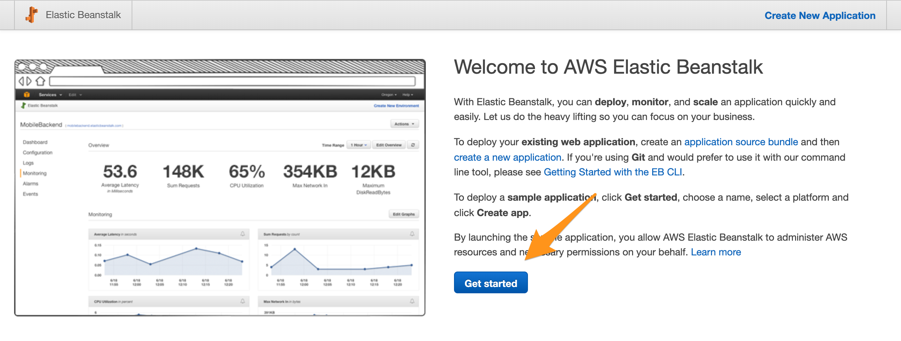
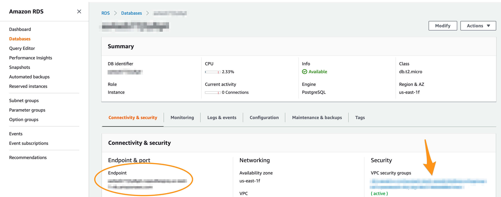
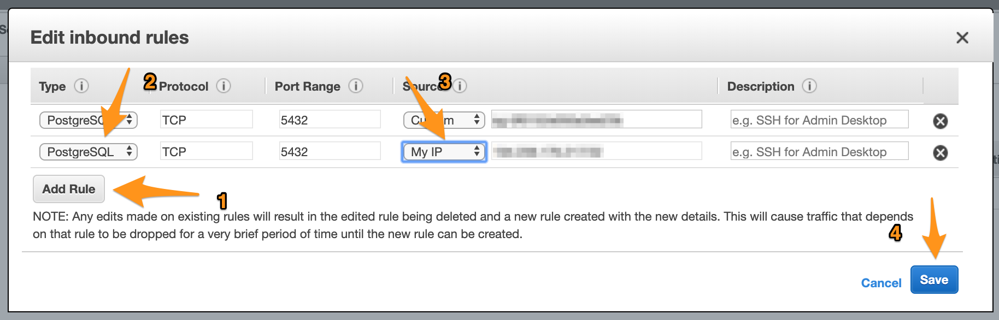

> This tutorial shows how to deploy an application with an SQL database to [AWS Beanstalk](https://console.aws.amazon.com/elasticbeanstalk/home). It assumes that you already have an AWS account and have access to your console.

## Prerequisites

### Do not use SQLite

SQLite databases are not supported by AWS Beanstalk. You have to use a different one such as Postgres, MySQL, MariaDB, Oracle or MSSQL.

Make sure that the SQLite driver is also uninstalled.

```
npm uninstall sqlite3 connect-sqlite3
```

### Configure the Database Credentials

Replace your `ormconfig.js` (or `ormconfig.yml` or `ormconfig.json`) file with this one:

*ormconfig.js*
```js
const { Config } = require('@foal/core');

module.exports = {
  type: Config.get('database.type'),
  url: Config.get('database.url'),
  database: process.env.RDS_DB_NAME || Config.get('database.name'),
  port: process.env.RDS_PORT || Config.get('database.port'),
  host: process.env.RDS_HOSTNAME || Config.get('database.host'),
  username: process.env.RDS_USERNAME || Config.get('database.username'),
  password: process.env.RDS_PASSWORD || Config.get('database.password'),
  entities: ["build/app/**/*.entity.js"],
  migrations: ["build/migrations/*.js"],
  cli: {
    "migrationsDir": "src/migrations"
  },
  synchronize: Config.get('database.synchronize')
};

```

And complete your configuration file `config/default.json` (or `config/default.yml`) with your local database credentials:

> The below credentials are an example. If you want to use them, you need to install PostgreSQL on your local host, create a database named `my-db` and install the postgres driver in your project (`npm install pg`). But you are free to use another database with other credentials if you want to.

```json
{
  "settings": {
    // ...
  },
  "database": {
    "type": "postgres",
    "name": "my-db",
    "port": 5432,
    "username": "postgres",
    "synchronize": true
  }
}
```

### Sessions

#### Case 1: The application does not use sessions

If you do not use sessions, then remove the store import and the store option from the `createApp` function in the `src/index.ts` file.

```typescript
import 'source-map-support/register';

// std
import * as http from 'http';

// 3p
import { Config, createApp } from '@foal/core';
// The store import is removed.
import { createConnection } from 'typeorm';

// App
import { AppController } from './app/app.controller';

async function main() {
  await createConnection();

  // The store option is removed.
  const app = createApp(AppController);

  const httpServer = http.createServer(app);
  const port = Config.get('port', 3001);
  httpServer.listen(port, () => {
    console.log(`Listening on port ${port}...`);
  });
}

main();

```

#### Case 2: The application uses sessions

If your application uses sessions, you need to provide a [session store](https://github.com/expressjs/session#compatible-session-stores).

Here is an example with [connect-redis](https://www.npmjs.com/package/connect-redis):

```typescript
import 'source-map-support/register';

// std
import * as http from 'http';

// 3p
import { Config, createApp } from '@foal/core';
import * as redisStoreFactory from 'connect-redis';
import { createConnection } from 'typeorm';

// App
import { AppController } from './app/app.controller';

async function main() {
  await createConnection();

  const app = createApp(AppController, {
    store: session => new (redisStoreFactory(session))(/* options */)
  });

  const httpServer = http.createServer(app);
  const port = Config.get('port', 3001);
  httpServer.listen(port, () => {
    console.log(`Listening on port ${port}...`);
  });
}

main();

```

> This guide does not explain how to set up a redis database on AWS Beanstalk.

## Create the AWS Application and Add a Database

Go to https://console.aws.amazon.com/elasticbeanstalk/home and click on *Get Started*.



Enter the name of your application, choose the *Node.js* platform and select the *Sample Application*.


AWS creates and loads the new application. **This takes a few minutes**. Then check that the application *health* is ok and open the application.

> If the health is incorrect, click on the *Causes* button to see what happened.


The home page should look like this:


Now it is time to configure your environment and add a database. Click on the *Configuration* button and set the environment variables `NODE_ENV` and `DATABASE_SYNCHRONIZE`.

> The `NODE_ENV` variable tells FoalTS to look at the production configuration (for example `config/production.json`).
>
> The `DATABASE_SYNCHRONIZE` variable tells TypeORM not to update the database schema on every application launch (see section [Generate & Run the Database Migrations](#Generate-&-Run-the-Database-Migrations) below).


Then create a new database from the configuration page.


Choose the database engine (postgres in this example) and enter the production database credentials.


## Deploy the Foal Application

Build the app.

```
npm run build:app
```

Create an archive from the directories and files `build/`, `config/`, `public/`, `ormconfig.json`, `package-lock.json` and `package.json`.


Upload the archive to AWS.


The application restarts. This may take a few minutes.

## Generate & Run the Database Migrations

**Warning, warning: this section is only compatible with projects created with FoalTS v0.8. If you need a tutorial for v1 and above, feel free to open a Github issue for that.**

Migrations are SQL queries that modify the database schemas (definition of the tables, relations, etc). By default, every new Foal project is created with the option `synchronize: true` in its `ormconfig`. This setting updates the database schema on every launch of the application.

But using this in production is considered unsafe (data could be lost for example if a model is changed by mistake). That's why we will generate and run migrations manually. To do this, we will need access to the database.

> **Warning** This section assumes that you have previously set the environment variable `DATABASE_SYNCHRONIZE` to `false`. This overrides the `synchronize` setting on AWS.

Go to [AWS database page](https://console.aws.amazon.com/rds/home#databases:) and click on your database.


Save the URL endpoint and click on the VPC security group. We will tell AWS that we can access the database from our local host.



Add a new *inbound* rule. **Make sure you don't delete the one that already exists.**




You are now able to communicate from your local host with the production database  (as long as you provide the correct credentials).

> The next part of the tutorial assumes that you did not change the default option `synchronize: true` in the `ormconfig` file. This is probably the case if you have never had to deal with migrations before.

Open **a new terminal/console**.

Enter the database credentials.

*On Mac and Linux*
```sh
export DATABASE_HOST=<the previous saved endpoint>
export DATABASE_USERNAME=<the database username> # in the tutorial, it is myusername
export DATABASE_PASSWORD=<the database password>
export DATABASE_NAME=ebdb
```

*On Windows*
```sh
set DATABASE_HOST=<the previous saved endpoint>
set DATABASE_USERNAME=<the database username> # in the tutorial, it is myusername
set DATABASE_PASSWORD=<the database password>
set DATABASE_NAME=ebdb
```

Generate the migration.

```sh
npm run migration:generate -- --name first-migration
```

A new migration file appears in `src/migrations/`. Check that it is correct and then build it.

```sh
npm run build:migrations
```

Then run the migration.

```sh
npm run migration:run
```

The database schema is updated. Your remote application should now run properly.

**Close your terminal / console**. Do not start your local application in the same terminal, otherwise it will run on your production database.

> **Caution:** Running migrations is always sensitive part of deployments. You should always back up your data before doing such a thing.
