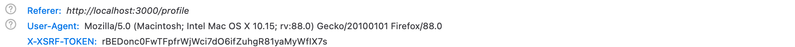

Since you use authentication with cookies, you need to add CSRF protection to your application.  This is really easy with Foal, even when building a SPA.

Open the `default.json` config file and enable the CSRF protection.

```json
{
  "port": "env(PORT)",
  "settings": {
    "session": {
      "store": "@foal/typeorm",
      "csrf": {
        "enabled": true
      }
    },
    ...
  }
  ...
}
```

Now, when using sessions with cookies, the server will send an additional token to the client in a cookie named `XSRF-Token`. This token will have to be retrieved by the front-end application and sent back in every subsequent POST, PATCH, PUT and DELETE request with the `X-XSRF-Token` header. If it is not, the server will return a 403 error.

If you use [axios](https://www.npmjs.com/package/axios) as your request library, as in this tutorial, you don't have to do anything. Everything is handled in the background. 

If you restart your development server and open your browser's development tools, you will see that axios automatically includes the token for you when creating a new story.

