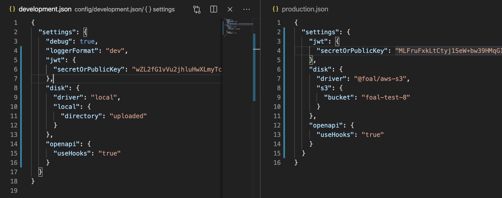
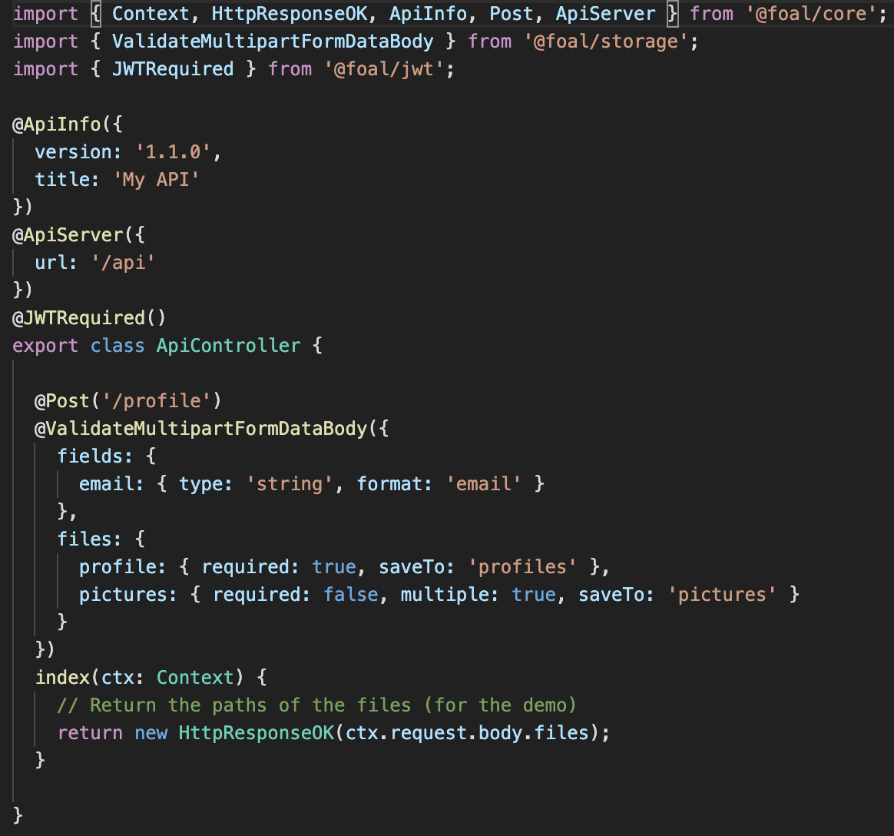
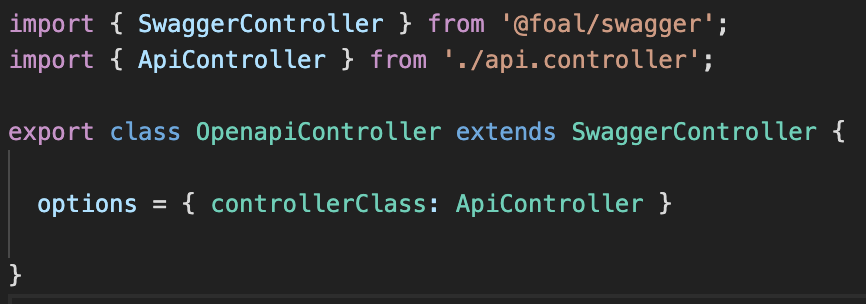
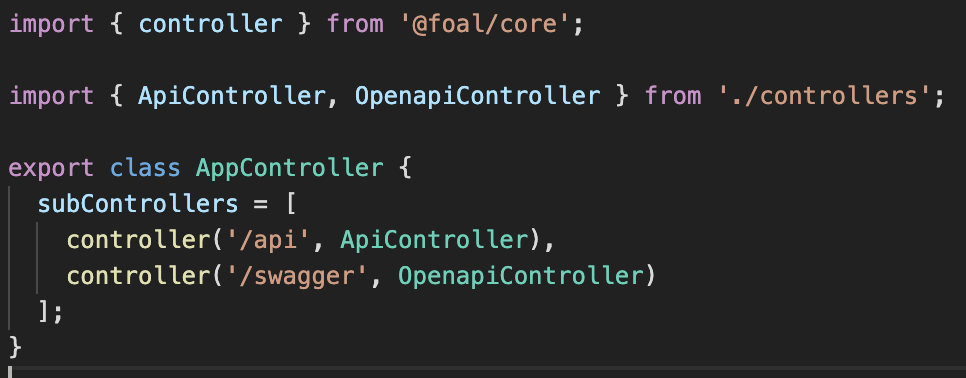
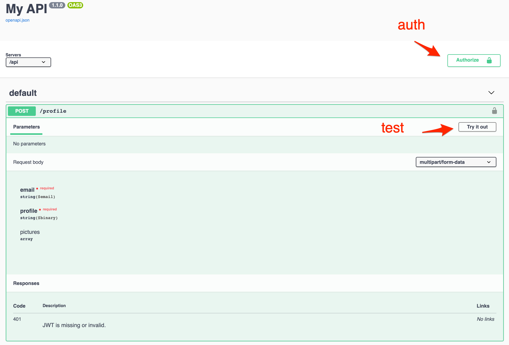
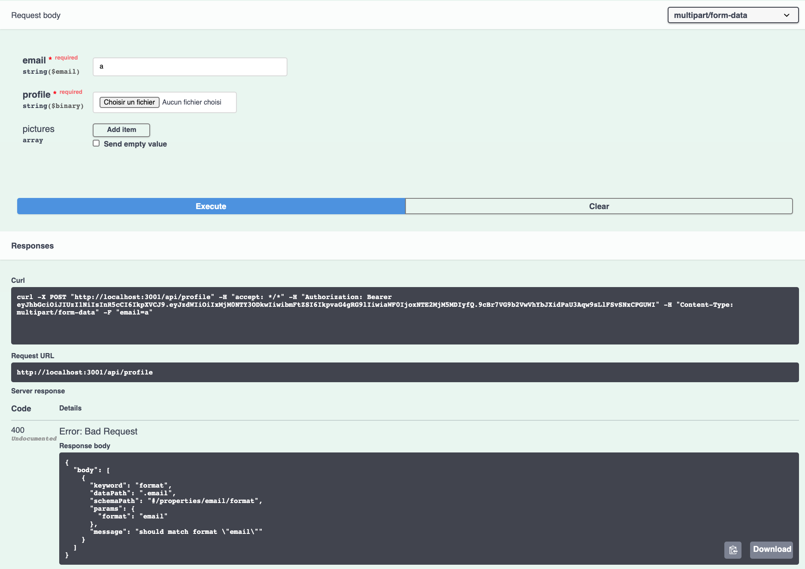
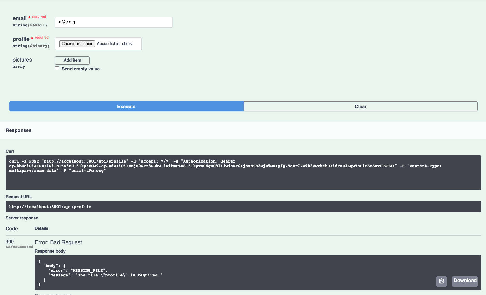
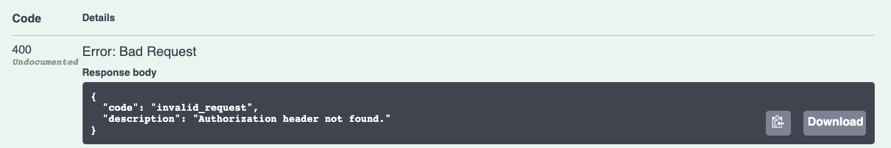
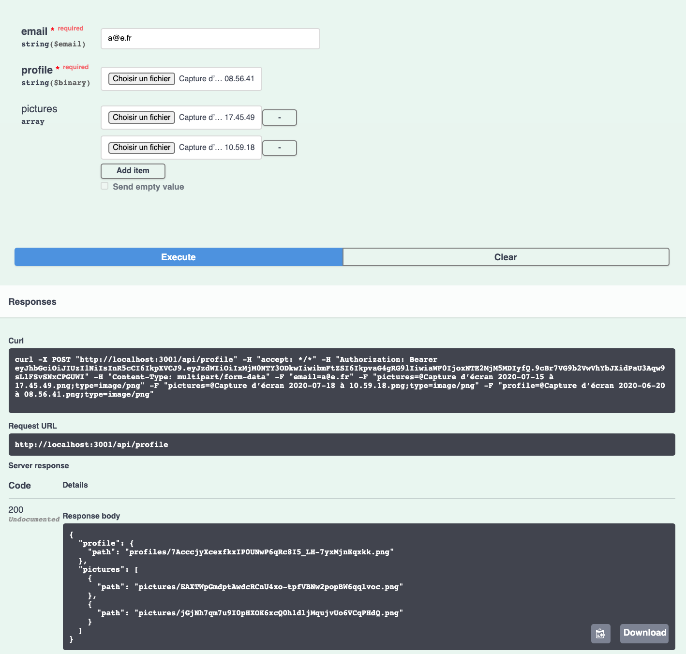
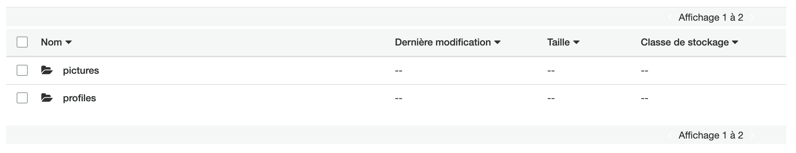

# README

## Goal


Let’s say that we’d like to upload in a single request:
- An email
- A profile image
- And other pictures


## Spec

- The email and the profile image are both required and the email must match an email format.
- When developing on my local host, the uploaded files should be saved on my local file system. Then, when deploying to production on AWS, the files should be saved in a S3 bucket. The code should remain the same. Only the configuration changes.
- If the email format is incorrect, the server should return a proper error message.
- If the profile image is missing, the server should return a proper error message.
- The upload should be done in streaming with the appropriate headers.
- Stream errors must be handled nicely at any part of the process.
- If the pictures are sent first in the request but, at the end, the profile image is missing, then the uploaded pictures must be deleted.
- The request requires an authentication with a JWT.
- Once my API is built, I’d like to generate from the code a complete Swagger UI interface to document and test the API.

## Code

```bash
foal createapp my-app
cd my-app
npm install @foal/jwt @foal/storage @foal/aws-s3 @foal/swagger
```

Create the directories `uploaded/profiles` and `uploaded/pictures`.

*Configuration files*


*API controller*


*Swagger controller*


*App controller*


## Result

*Swagger UI*


*Bad email*


*Missing profile file*


*No JWT*


*Upload (success)*


*AWS S3*
